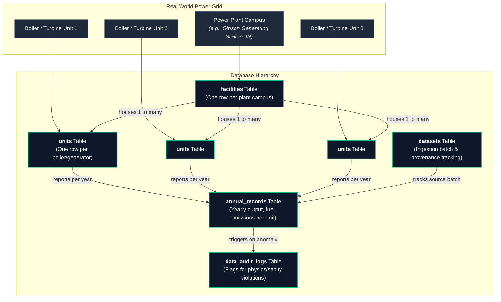
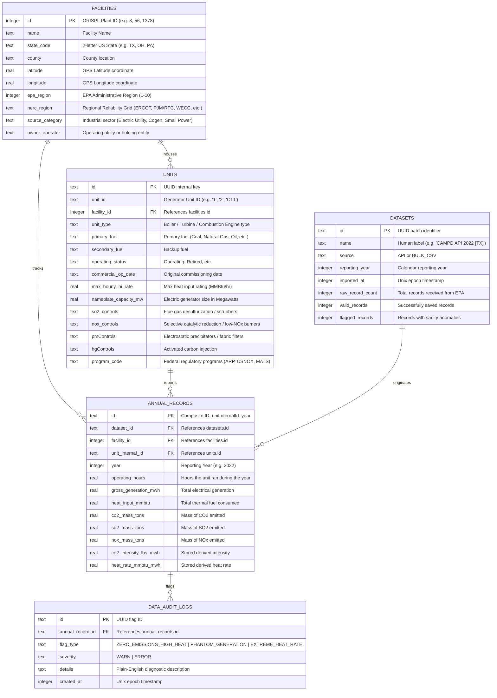
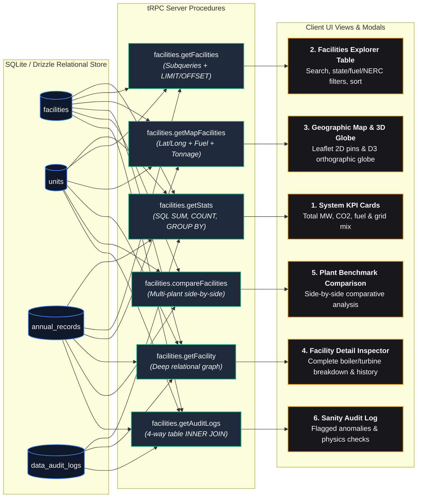
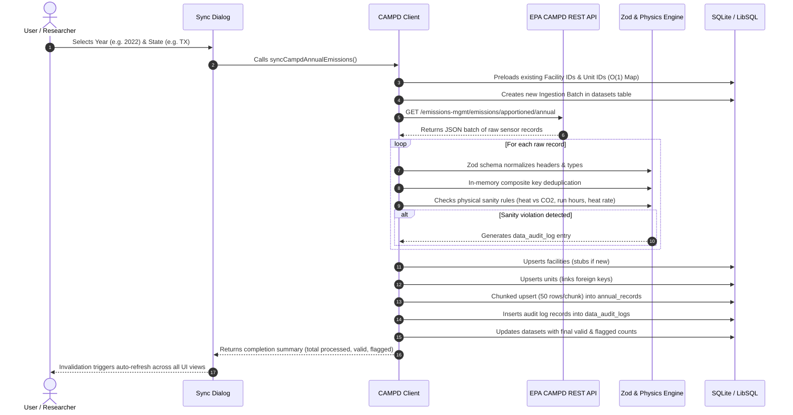

# EPA CAMPD Database Architecture & Data Breakdown

This document provides a plain-language, engineering-level breakdown of how our database is structured, where the data comes from, what each table stores, which columns our application actually uses, and how that information is sliced into separate user views.

---

## 1. What Is This Data? (The Big Picture)

The data in this application comes from the **EPA Clean Air Markets Program Data (CAMPD)** and the federal **Continuous Emission Monitoring Systems (CEMS)**. 

Every commercial power plant in the United States that burns fossil fuel and sells electricity to the grid is required by federal law (under programs like the Acid Rain Program and the Cross-State Air Pollution Rule) to install sensor packages directly inside their exhaust stacks. These sensors measure heat, electricity output, and exhaust gases 24 hours a day, 365 days a year.

To make sense of this data, we organize it into a five-level hierarchy:

### Key Real-World Concepts in Everyday Language

* **Facility (Power Plant)**: The physical facility or parcel of land (e.g., "Bowen Plant" in Georgia or "Monroe Power Plant" in Michigan). In the database, each facility has an official government ID number called an **ORISPL code** (Office of Regulatory Information Systems Plant code).
* **Generating Unit**: A single physical machine inside the plant that makes electricity or heat. A large coal or gas station typically has multiple units (e.g., "Unit 1", "Unit 2", "Combustion Turbine 1"). A unit has its own burner type, fuel supply, and pollution scrubbers.
* **MWh (Megawatt-hours)**: The amount of electrical energy the unit generated and sent onto the power grid. One MWh is roughly equal to the electricity an average American home consumes in one month.
* **Heat Input (MMBtu)**: The total thermal heat energy contained in the fuel that was burned. One MMBtu is 1,000,000 British Thermal Units. This tells us how much fuel went into the unit.
* **Mass Emissions (Tons of CO₂, SO₂, and NOx)**: The actual weight of pollutants released into the air through the smokestack over a given year:
  * **CO₂ (Carbon Dioxide)**: Primary greenhouse gas driving climate change.
  * **SO₂ (Sulfur Dioxide)**: Acid rain precursor, monitored strictly under the Clean Air Act.
  * **NOx (Nitrogen Oxides)**: Smog and ozone precursors that cause respiratory illness.
* **Heat Rate (MMBtu / MWh)**: Thermal efficiency. It measures: *"How much raw fuel energy did this unit have to burn to produce 1 MWh of electricity?"*
  * **Lower is better**: Modern combined-cycle gas plants run around 6.5 to 7.5 MMBtu/MWh. Old, inefficient peaking boilers run at 12.0 to 18.0+ MMBtu/MWh.
* **Carbon Intensity (lbs CO₂ / MWh)**: Emissions cleanliness. It measures: *"How many pounds of CO₂ entered the atmosphere for every single MWh of electricity generated?"*
  * **Lower is cleaner**: Clean natural gas typically runs between 700 and 1,000 lbs/MWh. Unabated coal plants run between 1,900 and 2,400+ lbs/MWh.

---

## 2. Relational Database Schema

Our relational database is stored in SQLite (via LibSQL / Turso) and managed with Drizzle ORM. It consists of 5 normalized tables:

---

## 3. Detailed Column Usage Breakdown

Not every column in a database is used everywhere. Some are needed for fast searching, some for map rendering, some for mathematical calculations, and others for provenance tracking.

Here is a breakdown of every table and how its fields are actively utilized:

### Table 1: `facilities`
Represents the physical power plant installation.

| Column | Type | What It Means | Where and How It Is Used |
| :--- | :--- | :--- | :--- |
| `id` | `INTEGER PRIMARY KEY` | EPA ORISPL Plant code. | **Core ID**: Table searches (exact numeric lookup), URL routes, inspect modals, benchmark comparison selections, foreign key joins. |
| `name` | `TEXT` | Legal plant name (e.g. "Cumberland", "W.A. Parish"). | **Display & Search**: Table title, fuzzy text search, map marker tooltips, head-to-head comparison cards. |
| `stateCode` | `TEXT(2)` | Two-letter state postal abbreviation. | **Filtering & Grouping**: State filter dropdown, table badges, map coloring, and regional queries. |
| `county` | `TEXT` | County where the plant is located. | **Context & Search**: Fuzzy search matches counties; displayed in facility inspector modal and comparison sheets. |
| `latitude` | `REAL` | GPS North coordinate. | **Mapping**: Used by Leaflet 2D maps and D3 3D orthographic globe to pin plant coordinates. |
| `longitude` | `REAL` | GPS West coordinate. | **Mapping**: Used by Leaflet 2D maps and D3 3D orthographic globe to pin plant coordinates. |
| `epaRegion` | `INTEGER` | Federal EPA administrative zone (1 through 10). | **Inspection**: Displayed in the plant detail dialog for regulatory context. |
| `nercRegion` | `TEXT` | Electric reliability grid council (ERCOT, PJM/RFC, WECC, SERC, MRO, SPP, etc.). | **Grid Analysis & Filtering**: NERC dropdown filter, KPI regional breakdown chart, comparison dialog grid specs. |
| `sourceCategory` | `TEXT` | Classification (Electric Utility, Cogeneration, Small Power Producer, etc.). | **Filtering & Classification**: Filter dropdown, table tags, and facility detail inspector. |
| `ownerOperator` | `TEXT` | Parent utility or corporate owner (e.g. Duke Energy, Southern Company). | **Search & Accountability**: Included in full-text search matching and displayed on plant cards. |

### Table 2: `units`
Represents individual generating machines (boilers, combustion turbines, generators) inside a facility.

| Column | Type | What It Means | Where and How It Is Used |
| :--- | :--- | :--- | :--- |
| `id` | `TEXT PRIMARY KEY` | UUID internal primary key. | **Foreign Key Anchor**: Links units to their yearly annual emissions records and audit logs. |
| `unitId` | `TEXT` | Human generator identifier (e.g. "1", "2", "CT1", "U1"). | **Unit Inspector**: Listed in the facility detail modal to identify specific smokestacks/generators. |
| `facilityId` | `INTEGER` | Foreign key referencing `facilities.id`. | **Relational Joins**: Allows grouping and rolling up units to their parent power plant. |
| `unitType` | `TEXT` | Burner configuration (Tangentially-fired boiler, Combined cycle, etc.). | **Unit Inspector**: Shown in the unit breakdown table inside the facility modal. |
| `primaryFuel` | `TEXT` | Main fuel burned (Coal, Natural Gas, Diesel Oil, Wood, etc.). | **Filtering & Visuals**: Primary fuel filter dropdown, table badges, map marker color coding, and fleet fuel breakdown. |
| `secondaryFuel` | `TEXT` | Backup or startup fuel. | **Comparison**: Displayed in the comparison dialog to show multi-fuel flexibility. |
| `operatingStatus` | `TEXT` | Status (Operating, Retired, Cold Standby). | **Fleet Health**: Displayed in the unit breakdown table; used in comparison to count active vs retired units. |
| `commercialOpDate` | `TEXT` | Year/date the unit entered commercial service. | **Age Analysis**: Displayed in the unit table to indicate equipment age and generation era. |
| `maxHourlyHIRate` | `REAL` | Maximum design heat input rate (MMBtu/hour). | **Physical Rating**: Stored for combustion capacity analysis. |
| `nameplateCapacityMW` | `REAL` | Electrical generator nameplate capacity in Megawatts (MW). | **Capacity Aggregations**: Summed at the plant level for table sorting, map pin scaling, and KPI cards (`totalCapacityMW`). |
| `so2Controls` | `TEXT` | Sulfur scrubbers (e.g., Wet Limestone Scrubber). | **Environmental Abatement**: Checked to compute "controlled units count" badge in table; detailed in comparison modal. |
| `noxControls` | `TEXT` | Nitrogen reduction tech (e.g., Low NOx Burner, SCR). | **Environmental Abatement**: Displayed in unit inspector and used in emission controls tally. |
| `pmControls` | `TEXT` | Particulate matter filters (e.g., Fabric Filter baghouses). | **Environmental Abatement**: Displayed in unit inspector modal. |
| `hgControls` | `TEXT` | Mercury sorbent systems (e.g., Activated Carbon). | **Environmental Abatement**: Displayed in unit inspector modal. |
| `programCode` | `TEXT` | Applicable Clean Air Act regulatory programs. | **Regulatory Compliance**: Displayed in unit inspector. |

### Table 3: `annual_records`
Stores the annual operational metrics and pollution mass for one unit for one calendar year.

| Column | Type | What It Means | Where and How It Is Used |
| :--- | :--- | :--- | :--- |
| `id` | `TEXT PRIMARY KEY` | Formatted string: `${unitInternalId}_${year}`. | **Unique Ledger ID**: Enforces natural deduplication so re-syncing the same year updates rather than duplicates. |
| `facilityId` | `INTEGER` | Foreign key referencing `facilities.id`. | **Plant Rollups**: Fast indexing for plant-level SQL aggregations without multi-hop unit joins. |
| `unitInternalId` | `TEXT` | Foreign key referencing `units.id`. | **Unit Ledger**: Links this yearly row to the specific physical turbine/boiler. |
| `year` | `INTEGER` | Calendar reporting year (e.g. 2022). | **Time Slicing**: Filtering records by reporting year; displayed in timeline cards. |
| `operatingHours` | `REAL` | Number of hours the machine ran during the year. | **Utilization & Sanity**: Aggregated to total plant run time; audited against generation (`PHANTOM_GENERATION` check). |
| `grossGenerationMWh` | `REAL` | Total electricity produced (Megawatt-hours). | **Productivity & Intensity**: Summed for total generation KPI; serves as the denominator for carbon intensity and heat rate. |
| `heatInputMMBtu` | `REAL` | Total fuel thermal energy consumed. | **Efficiency**: Summed to determine fuel volume; numerator for heat rate calculation. |
| `co2MassTons` | `REAL` | Weight of carbon dioxide released (short tons). | **Emissions Impact**: Summed for plant-level CO₂ rank, map bubble scaling, KPI totals, and carbon intensity numerator. |
| `so2MassTons` | `REAL` | Weight of sulfur dioxide released (short tons). | **Acid Rain Tracking**: Displayed in annual unit history and plant comparison benchmark. |
| `noxMassTons` | `REAL` | Weight of nitrogen oxides released (short tons). | **Smog Tracking**: Displayed in annual unit history and plant comparison benchmark. |
| `co2IntensityLbsMWh` | `REAL` | Stored carbon intensity ($(\text{CO}_2 \times 2000) / \text{Generation}$). | **Precomputed Metric**: Unit-level clean energy scoring. Note: The app also dynamically recomputes this at the facility level via SQL. |
| `heatRateMMBtuMWh` | `REAL` | Stored heat rate ($\text{Heat Input} / \text{Generation}$). | **Thermal Sanity & Efficiency**: Evaluated by anomaly engine (`EXTREME_HEAT_RATE`); displayed in comparison modal. |

### Table 4: `data_audit_logs`
Records anomalies discovered during data ingestion by the automated physical sanity engine.

| Column | Type | What It Means | Where and How It Is Used |
| :--- | :--- | :--- | :--- |
| `id` | `TEXT PRIMARY KEY` | UUID identifier for the violation. | **Log Key**: Primary key for audit table rendering. |
| `annualRecordId` | `TEXT` | Foreign key referencing `annual_records.id`. | **Relational Join**: Joins audit flags to the offending unit, facility name, and year. |
| `flagType` | `TEXT` | Category of physics violation. | **Categorization**: Grouping into `ZERO_EMISSIONS_HIGH_HEAT`, `PHANTOM_GENERATION`, or `EXTREME_HEAT_RATE`. |
| `severity` | `TEXT` | Level of concern (`ERROR` or `WARN`). | **Visual Alerting**: Determines badge colors (crimson vs amber) in the Audits tab. |
| `details` | `TEXT` | Plain-language diagnostic explanation. | **Audit Log Display**: Explains the exact numbers that triggered the flag so researchers understand why it failed. |
| `createdAt` | `INTEGER` | Unix timestamp of when the violation was flagged. | **Audit Trail**: Sorting logs chronologically to see the newest ingestion flags first. |

### Table 5: `datasets`
Tracks batch ingestion history from the EPA REST API or bulk CSV files.

| Column | Type | What It Means | Where and How It Is Used |
| :--- | :--- | :--- | :--- |
| `id` | `TEXT PRIMARY KEY` | UUID batch ID. | **Batch FK**: Referenced by `annual_records.datasetId`. |
| `name` | `TEXT` | Label (e.g. "CAMPD API 2022 [TX]"). | **Provenance**: Tells the user which import run created or updated a given record. |
| `source` | `TEXT` | `API` or `BULK_CSV`. | **Data Lineage**: Distinguishes between automated REST syncs and historical CSV dumps. |
| `reportingYear` | `INTEGER` | The calendar year ingested. | **Lineage**: Shows which calendar year this batch applied to. |
| `importedAt` | `INTEGER` | Unix timestamp when the job ran. | **Audit Trail**: Records when data was synced. |
| `rawRecordCount` | `INTEGER` | Total records parsed from EPA. | **Health Check**: Displayed in sync modal completion toast. |
| `validRecords` | `INTEGER` | Clean records saved to database. | **Health Check**: Displayed in sync modal completion toast. |
| `flaggedRecords` | `INTEGER` | Records that raised physics audit flags. | **Health Check**: Displayed in sync modal completion toast. |

---

## 4. How the Data Is Split Across the Views

Instead of dumping everything into one slow, overwhelming table, we split the data across **6 distinct views and modals**. Each view queries only the specific slice of data it requires:

---

### View 1: Top-Level System KPI Cards (`StatMetrics`)
* **Purpose**: Gives an instant 10,000-foot summary of the entire US electrical grid represented in the local database.
* **Query Used**: `api.facilities.getStats`
* **What Part of the Table It Uses**:
  * `facilities`: `COUNT(*)` for total facilities, `COUNT(DISTINCT state_code)` for states covered, `COUNT(DISTINCT nerc_region)` for grid regions, and `GROUP BY nerc_region` to find the largest grid sectors.
  * `units`: `COUNT(*)` for total units, `SUM(nameplate_capacity_mw)` for total grid capacity, and `GROUP BY primary_fuel` to calculate fuel type distribution (e.g. Natural Gas vs Coal vs Oil).
  * `annual_records`: `SUM(co2_mass_tons)` for total carbon pollution, `SUM(gross_generation_mwh)` for total electricity produced.
  * `data_audit_logs`: `COUNT(*)` for total flagged anomalies.
* **Why It’s Built This Way**: The database computes these totals in a single fast query. The browser receives only a tiny JSON summary (a few hundred bytes), loading instantly without transferring thousands of rows.

---

### View 2: Facilities Explorer Table (`FacilitiesTable` & `FacilityFilters`)
* **Purpose**: The primary interactive workspace for browsing, searching, and filtering all 1,500+ facilities.
* **Query Used**: `api.facilities.getFacilities` (supports pagination, text search, and 4 dropdown filters)
* **What Part of the Table It Uses**:
  * **From `facilities`**: `id`, `name`, `stateCode`, `county`, `nercRegion`, `sourceCategory`, `ownerOperator`.
  * **Aggregated Subqueries from `units`**:
    * `unitCount`: `COUNT(*)` of generating units inside the plant.
    * `totalCapacityMW`: `SUM(nameplate_capacity_mw)` to show total plant size.
    * `primaryFuelsRaw`: `GROUP_CONCAT(DISTINCT primary_fuel)` to render distinct fuel badges (e.g. `[Coal, Gas]`).
    * `controlledUnitsCount`: Count of units with scrubbers/burners installed.
  * **Aggregated Subqueries from `annual_records`**:
    * `totalCo2Tons`: `SUM(co2_mass_tons)` for the plant.
    * `totalOperatingHours`: `SUM(operating_hours)` total run time.
    * `carbonIntensityLbsMWh`: Dynamically computed in SQL as:
      $$\text{Carbon Intensity} = \frac{\sum \text{co2\_mass\_tons} \times 2000}{\sum \text{gross\_generation\_mwh}}$$
      Rendered in the table as a clean badge (green if $< 1,000$, amber if $1,000 - 1,800$, red if $> 1,800$ lbs/MWh).
* **Why It’s Built This Way**: Instead of transferring every unit record to the client, the backend rolls up each facility into a single concise row. Pagination (`10`, `25`, or `50` rows per page) ensures ultra-responsive page changes.

---

### View 3: Geographic Map & 3D Globe (`FacilitiesMap`, `LeafletMap`, `D3Globe`)
* **Purpose**: Visualizing spatial patterns of power generation and carbon emissions across the US.
* **Query Used**: `api.facilities.getMapFacilities`
* **What Part of the Table It Uses**:
  * `facilities`: `id`, `name`, `stateCode`, `county`, `latitude`, `longitude`, `nercRegion`, `sourceCategory`.
  * `units`: Subquery for `primary_fuel` (used to color-code map markers: orange for Gas, dark slate for Coal, red for Oil, green for Solar/Hydro) and `totalCapacityMW`.
  * `annual_records`: `totalCo2Tons` (used to calculate marker radius/glow intensity).
* **Why It’s Built This Way**: Heavy fields like individual boiler IDs, scrubber names, and yearly historical ledgers are stripped out. The map gets only coordinates and sizing metrics, allowing smooth 60fps panning, zooming, and 3D globe rotation.

---

### View 4: Facility Deep-Dive Inspector (`FacilityDetailDialog`)
* **Purpose**: Provides a full technical and environmental drill-down on a single selected power plant.
* **Query Used**: `api.facilities.getFacility` (triggered when a user clicks any plant row or map pin)
* **What Part of the Table It Uses**:
  * **Full `facilities` row**: Name, ORISPL ID, county, state, EPA region, NERC reliability zone, owner/operator.
  * **Full list of child `units`**: Unit ID, burner/generator type, nameplate capacity (MW), operating status (Operating vs Retired), commissioning date, and full scrubber inventory (SO₂ scrubbers, NOx SCR, PM baghouses, mercury controls).
  * **Year-by-year history from `annual_records`**: Operating hours, gross generation (MWh), heat input (MMBtu), mass emissions (CO₂, SO₂, NOx), and calculated heat rate and carbon intensity.
  * **Associated `data_audit_logs`**: If any annual record for this plant triggered a physics check, it is displayed right in the inspector.
* **Why It’s Built This Way**: This is lazy-loaded on demand. We only query the deep relational tree for one facility when the user explicitly requests it, keeping overall app performance fast.

---

### View 5: Head-to-Head Plant Comparison Modal (`PlantComparisonDialog`)
* **Purpose**: Allows users to select 2 to 4 power plants and compare their performance side-by-side.
* **Query Used**: `api.facilities.compareFacilities` (takes an array of 2 to 4 facility IDs)
* **What Part of the Table It Uses**:
  * **Grid & Fleet Specs**: Names, states, NERC regions, operator entities, and primary fuel mixes.
  * **Capacity & Operations**: Total capacity (MW), active operating unit counts, total operating hours, and total generation (MWh).
  * **Pollutant Benchmarking**: Direct side-by-side comparison of total tons of CO₂, SO₂, and NOx.
  * **Efficiency Comparison**: Heat rate (thermal efficiency) and carbon intensity (cleanliness per MWh).
  * **Technology Abatement**: Tally of units equipped with SO₂, NOx, and particulate matter controls.
* **Why It’s Built This Way**: Pulls all selected plants into a normalized comparative schema, enabling instant answers to questions like *"Which plant in the Midwest produces more energy per ton of carbon?"*

---

### View 6: Data Quality & Physics Audit Log (`AuditLogsTable`)
* **Purpose**: Dedicated quality-control dashboard displaying data anomalies detected during ingestion.
* **Query Used**: `api.facilities.getAuditLogs`
* **What Part of the Table It Uses**:
  * Joins `data_audit_logs` + `annual_records` + `facilities` + `units`.
  * Extracts the facility name, unit ID, reporting year, violation flag type, severity (`ERROR` / `WARN`), and plain-English diagnostic description.
* **The Physics Rules We Check** (enforced via `AUDIT_THRESHOLDS` in `src/server/campd/client.ts`):
  1. **`ZERO_EMISSIONS_HIGH_HEAT`** (`severity: "ERROR"`): A fossil fuel generator consumed heat energy above the threshold (`heatInputMMBtu > 1,000 MMBtu`), but reported 0.0 tons of CO₂ emissions (`co2MassTons === 0`), which is physically impossible when combusting hydrocarbon fuels.
  2. **`PHANTOM_GENERATION`** (`severity: "ERROR"`): A generator produced electricity (`grossGenerationMWh > 0 MWh`), but recorded 0.0 hours of operating time (`operatingHours === 0`).
  3. **`EXTREME_HEAT_RATE`** (`severity: "WARN"`): The calculated heat rate falls outside standard thermodynamic limits (< 5.0 or > 25.0 MMBtu/MWh: `heatRateMMBtuMWh < 5.0 || heatRateMMBtuMWh > 25.0`), indicating faulty generation or fuel telemetry.
* **Why It’s Built This Way**: Isolates suspicious or corrupt data points into a dedicated review screen with human-friendly descriptions rather than silently corrupting fleet-wide averages.

---

## 5. Live Ingestion & Sync Workflow

When a user clicks the **Sync Data** button or runs the synchronization script, data flows through an automated pipeline:

---

## 6. Summary Matrix: Where Each Column Lives in the UI

| Database Table | Column Name | System KPIs | Explorer Table | Geographic Map | Plant Inspector | Compare Modal | Audits Tab |
| :--- | :--- | :---: | :---: | :---: | :---: | :---: | :---: |
| **`facilities`** | `id` (ORISPL) | | **Yes** | **Yes** | **Yes** | **Yes** | **Yes** |
| | `name` | | **Yes** | **Yes** | **Yes** | **Yes** | **Yes** |
| | `stateCode` | **Yes** (Count) | **Yes** | **Yes** | **Yes** | **Yes** | |
| | `county` | | **Yes** | **Yes** | **Yes** | **Yes** | |
| | `latitude` / `longitude` | | | **Yes** | | | |
| | `nercRegion` | **Yes** (Mix) | **Yes** | **Yes** | **Yes** | **Yes** | |
| | `sourceCategory` | | **Yes** | **Yes** | **Yes** | **Yes** | |
| | `ownerOperator` | | **Yes** | **Yes** | **Yes** | **Yes** | |
| **`units`** | `unitId` | | | | **Yes** | | **Yes** |
| | `primaryFuel` | **Yes** (Mix) | **Yes** | **Yes** | **Yes** | **Yes** | |
| | `unitType` | | | | **Yes** | | |
| | `operatingStatus` | | | | **Yes** | **Yes** | |
| | `nameplateCapacityMW` | **Yes** (Total) | **Yes** (Total) | **Yes** (Scale) | **Yes** | **Yes** | |
| | Environmental Controls (`so2`, `nox`, `pm`, `hg`) | | **Yes** (Count) | | **Yes** (List) | **Yes** (Tally) | |
| **`annual_records`** | `grossGenerationMWh` | **Yes** (Total) | | | **Yes** | **Yes** | |
| | `operatingHours` | | **Yes** (Total) | | **Yes** | **Yes** | |
| | `heatInputMMBtu` | | | | **Yes** | **Yes** | |
| | `co2MassTons` | **Yes** (Total) | **Yes** (Total) | **Yes** (Scale) | **Yes** | **Yes** | |
| | `so2MassTons` / `noxMassTons` | | | | **Yes** | **Yes** | |
| | `co2IntensityLbsMWh` | | **Yes** (Badge) | | **Yes** | **Yes** | |
| | `heatRateMMBtuMWh` | | | | **Yes** | **Yes** | |
| **`data_audit_logs`**| `flagType` / `severity` / `details` | **Yes** (Count) | | | **Yes** | | **Yes** |
| **`datasets`** | `name` / `importedAt` / `rawRecordCount` | | | | | | **Sync Modal** |

---

## 7. Conclusion

By separating concerns across:
1. **Normalized physical tables** (`facilities` $\rightarrow$ `units` $\rightarrow$ `annual_records`),
2. **Automated validation checks** (`data_audit_logs`), and
3. **Targeted server-side aggregations** tailored specifically for each front-end view,

the application maintains high performance even with thousands of power plant units, rich geospatial mapping, and complex physics audits, all running seamlessly on top of a lightweight, portable SQLite database.
