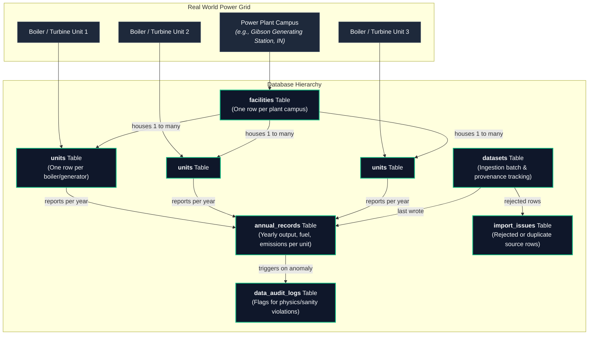
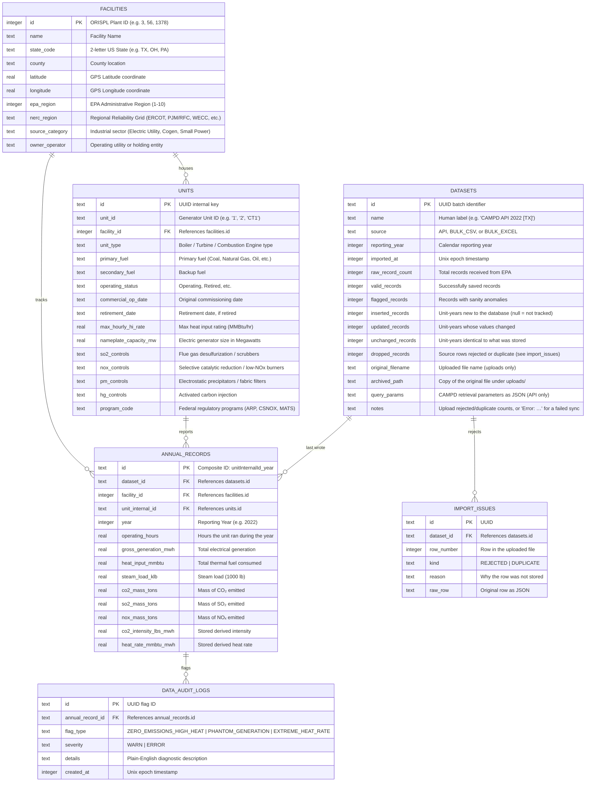
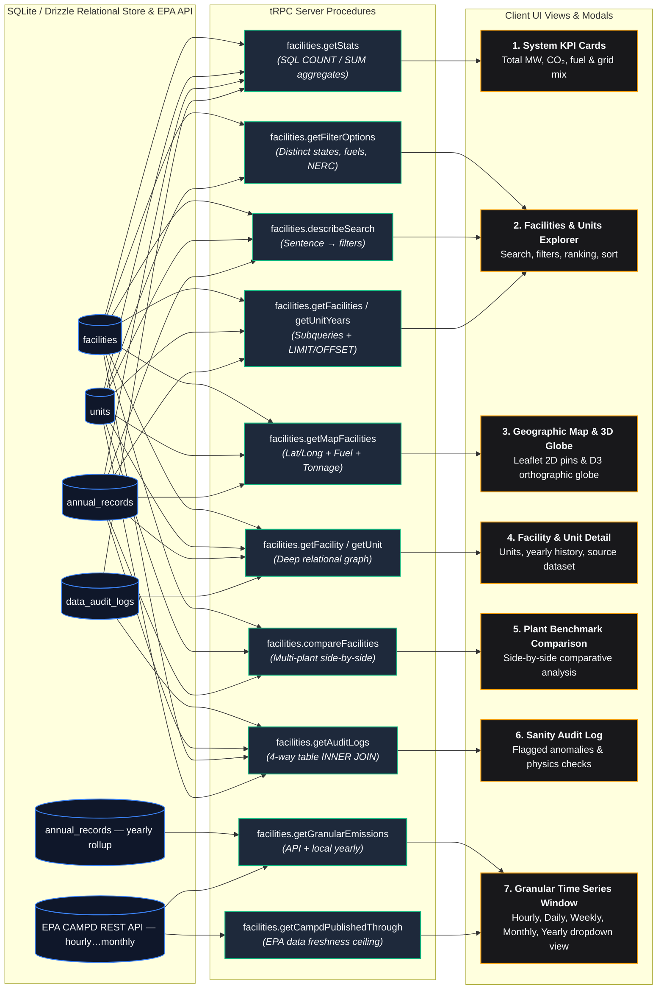
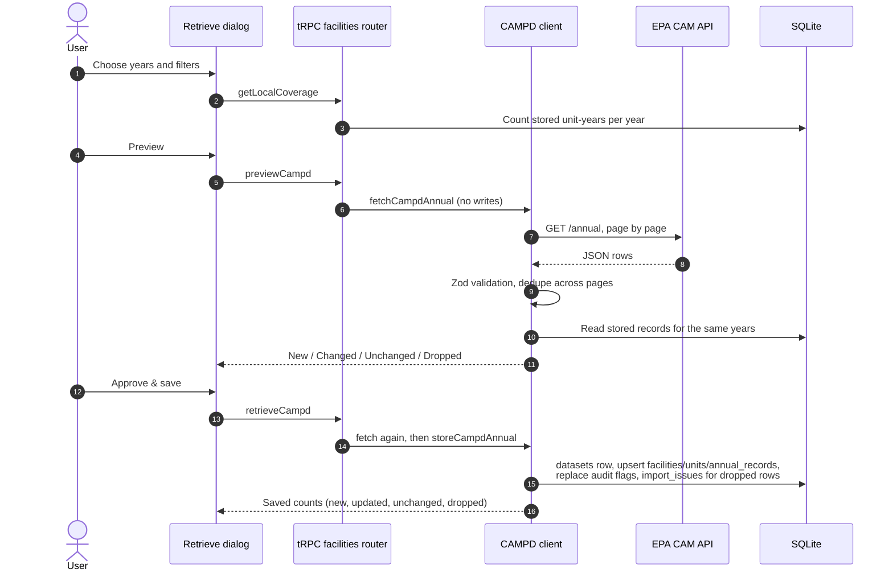

# EPA CAMPD Database Architecture & Data Breakdown

This document provides a plain-language, engineering-level breakdown of how our database is structured, where the data comes from, what each table stores, which columns our application actually uses, and how that information is sliced into separate user views.

---

## 1. What Is This Data? (The Big Picture)

The data in this application comes from the **EPA Clean Air Markets Program Data (CAMPD)** and the federal **Continuous Emission Monitoring Systems (CEMS)**.

Fossil-fuel generating units covered by federal programs such as the Acid Rain Program and the Cross-State Air Pollution Rule must monitor and report their heat input, electricity output, and stack emissions, mostly hour by hour through continuous emission monitoring systems. EPA publishes the reports through CAMPD; epaData stores the annual totals per unit.

To make sense of this data, we organize it into a five-level hierarchy:

```mermaid
flowchart TD
    subgraph Real World Power Grid
        A["Power Plant Campus<br/><i>(e.g., Gibson Generating Station, IN)</i>"]
        B1["Boiler / Turbine Unit 1"]
        B2["Boiler / Turbine Unit 2"]
        B3["Boiler / Turbine Unit 3"]
    end

    subgraph Database Hierarchy
        F["<b>facilities</b> Table<br/>(One row per plant campus)"]
        U1["<b>units</b> Table<br/>(One row per boiler/generator)"]
        U2["<b>units</b> Table"]
        U3["<b>units</b> Table"]
        AR["<b>annual_records</b> Table<br/>(Yearly output, fuel, emissions per unit)"]
        AL["<b>data_audit_logs</b> Table<br/>(Flags for physics/sanity violations)"]
        DS["<b>datasets</b> Table<br/>(Ingestion batch & provenance tracking)"]
        II["<b>import_issues</b> Table<br/>(Rejected or duplicate source rows)"]
    end

    A --> F
    B1 --> U1
    B2 --> U2
    B3 --> U3
    F -->|houses 1 to many| U1
    F -->|houses 1 to many| U2
    F -->|houses 1 to many| U3
    U1 -->|reports per year| AR
    U2 -->|reports per year| AR
    U3 -->|reports per year| AR
    AR -->|triggers on anomaly| AL
    DS -->|last wrote| AR
    DS -->|rejected rows| II

    classDef real fill:#1e293b,stroke:#475569,stroke-width:1px,color:#f8fafc;
    classDef db fill:#0f172a,stroke:#10b981,stroke-width:2px,color:#f8fafc;
    class A,B1,B2,B3 real;
    class F,U1,U2,U3,AR,AL,DS,II db;
```

### Key Real-World Concepts in Everyday Language

- **Facility (Power Plant)**: The physical facility or parcel of land (e.g., "Bowen Plant" in Georgia or "Monroe Power Plant" in Michigan). In the database, each facility has an official government ID number called an **ORISPL code** (Office of Regulatory Information Systems Plant code).
- **Generating Unit**: A single physical machine inside the plant that makes electricity or heat. A large coal or gas station typically has multiple units (e.g., "Unit 1", "Unit 2", "Combustion Turbine 1"). A unit has its own burner type, fuel supply, and pollution scrubbers.
- **MWh (Megawatt-hours)**: The amount of electrical energy the unit generated and sent onto the power grid. One MWh is roughly equal to the electricity an average American home consumes in one month.
- **Heat Input (MMBtu)**: The total thermal heat energy contained in the fuel that was burned. One MMBtu is 1,000,000 British Thermal Units. This tells us how much fuel went into the unit.
- **Mass Emissions (Tons of CO₂, SO₂, and NOₓ)**: The actual weight of pollutants released into the air through the smokestack over a given year:
  - **CO₂ (Carbon Dioxide)**: Primary greenhouse gas driving climate change.
  - **SO₂ (Sulfur Dioxide)**: Acid rain precursor, monitored strictly under the Clean Air Act.
  - **NOₓ (Nitrogen Oxides)**: Smog and ozone precursors that cause respiratory illness.
- **Heat Rate (MMBtu / MWh)**: Thermal efficiency. It measures: _"How much raw fuel energy did this unit have to burn to produce 1 MWh of electricity?"_
  - **Lower is better**: Modern combined-cycle gas plants run around 6.5 to 7.5 MMBtu/MWh. Old, inefficient peaking boilers run at 12.0 to 18.0+ MMBtu/MWh.
- **Carbon Intensity (lbs CO₂ / MWh)**: Emissions cleanliness. It measures: _"How many pounds of CO₂ entered the atmosphere for every single MWh of electricity generated?"_
  - **Lower is cleaner**: Clean natural gas typically runs between 700 and 1,000 lbs/MWh. Unabated coal plants run between 1,900 and 2,400+ lbs/MWh.

---

## 2. Relational Database Schema

Our relational database is stored in SQLite (through the libSQL client) and managed with Drizzle ORM. It consists of 6 normalized tables:

```mermaid
erDiagram
    FACILITIES ||--o{ UNITS : "houses"
    FACILITIES ||--o{ ANNUAL_RECORDS : "tracks"
    UNITS ||--o{ ANNUAL_RECORDS : "reports"
    DATASETS ||--o{ ANNUAL_RECORDS : "last wrote"
    ANNUAL_RECORDS ||--o{ DATA_AUDIT_LOGS : "flags"
    DATASETS ||--o{ IMPORT_ISSUES : "rejects"

    FACILITIES {
        integer id PK "ORISPL Plant ID (e.g. 3, 56, 1378)"
        text name "Facility Name"
        text state_code "2-letter US State (e.g. TX, OH, PA)"
        text county "County location"
        real latitude "GPS Latitude coordinate"
        real longitude "GPS Longitude coordinate"
        integer epa_region "EPA Administrative Region (1-10)"
        text nerc_region "Regional Reliability Grid (ERCOT, PJM/RFC, WECC, etc.)"
        text source_category "Industrial sector (Electric Utility, Cogen, Small Power)"
        text owner_operator "Operating utility or holding entity"
    }

    UNITS {
        text id PK "UUID internal key"
        text unit_id "Generator Unit ID (e.g. '1', '2', 'CT1')"
        integer facility_id FK "References facilities.id"
        text unit_type "Boiler / Turbine / Combustion Engine type"
        text primary_fuel "Primary fuel (Coal, Natural Gas, Oil, etc.)"
        text secondary_fuel "Backup fuel"
        text operating_status "Operating, Retired, etc."
        text commercial_op_date "Original commissioning date"
        text retirement_date "Retirement date, if retired"
        real max_hourly_hi_rate "Max heat input rating (MMBtu/hr)"
        real nameplate_capacity_mw "Electric generator size in Megawatts"
        text so2_controls "Flue gas desulfurization / scrubbers"
        text nox_controls "Selective catalytic reduction / low-NOx burners"
        text pm_controls "Electrostatic precipitators / fabric filters"
        text hg_controls "Activated carbon injection"
        text program_code "Federal regulatory programs (ARP, CSNOX, MATS)"
    }

    DATASETS {
        text id PK "UUID batch identifier"
        text name "Human label (e.g. 'CAMPD API 2022 [TX]')"
        text source "API, BULK_CSV, or BULK_EXCEL"
        integer reporting_year "Calendar reporting year"
        integer imported_at "Unix epoch timestamp"
        integer raw_record_count "Total records received from EPA"
        integer valid_records "Successfully saved records"
        integer flagged_records "Records with sanity anomalies"
        integer inserted_records "Unit-years new to the database (null = not tracked)"
        integer updated_records "Unit-years whose values changed"
        integer unchanged_records "Unit-years identical to what was stored"
        integer dropped_records "Source rows rejected or duplicate (see import_issues)"
        text original_filename "Uploaded file name (uploads only)"
        text archived_path "Copy of the original file under uploads/"
        text query_params "CAMPD retrieval parameters as JSON (API only)"
        text notes "Upload rejected/duplicate counts, or 'Error: …' for a failed sync"
    }

    ANNUAL_RECORDS {
        text id PK "Composite ID: unitInternalId_year"
        text dataset_id FK "References datasets.id"
        integer facility_id FK "References facilities.id"
        text unit_internal_id FK "References units.id"
        integer year "Reporting Year (e.g. 2022)"
        real operating_hours "Hours the unit ran during the year"
        real gross_generation_mwh "Total electrical generation"
        real heat_input_mmbtu "Total thermal fuel consumed"
        real steam_load_klb "Steam load (1000 lb)"
        real co2_mass_tons "Mass of CO₂ emitted"
        real so2_mass_tons "Mass of SO₂ emitted"
        real nox_mass_tons "Mass of NOₓ emitted"
        real co2_intensity_lbs_mwh "Stored derived intensity"
        real heat_rate_mmbtu_mwh "Stored derived heat rate"
    }

    IMPORT_ISSUES {
        text id PK "UUID"
        text dataset_id FK "References datasets.id"
        integer row_number "Row in the uploaded file"
        text kind "REJECTED | DUPLICATE"
        text reason "Why the row was not stored"
        text raw_row "Original row as JSON"
    }

    DATA_AUDIT_LOGS {
        text id PK "UUID flag ID"
        text annual_record_id FK "References annual_records.id"
        text flag_type "ZERO_EMISSIONS_HIGH_HEAT | PHANTOM_GENERATION | EXTREME_HEAT_RATE"
        text severity "WARN | ERROR"
        text details "Plain-English diagnostic description"
        integer created_at "Unix epoch timestamp"
    }
```

---

## 3. Column Reference

Drizzle property names below; SQLite column names are snake_case equivalents. Section 6 has a quick UI coverage matrix.

### Table 1: `facilities`

Represents the physical power plant installation.

| Column           | Type                  | What It Means                                                                   | Where and How It Is Used                                                                                                                                     |
| :--------------- | :-------------------- | :------------------------------------------------------------------------------ | :----------------------------------------------------------------------------------------------------------------------------------------------------------- |
| `id`             | `INTEGER PRIMARY KEY` | EPA ORISPL Plant code.                                                          | **Core ID**: Table searches (exact numeric lookup), URL routes, inspect modals, benchmark comparison selections, foreign key joins.                          |
| `name`           | `TEXT`                | Legal plant name (e.g. "Cumberland", "W.A. Parish").                            | **Display & Search**: Table title, fuzzy text search, map marker tooltips, head-to-head comparison cards.                                                    |
| `stateCode`      | `TEXT(2)`             | Two-letter state postal abbreviation.                                           | **Filtering & Grouping**: State filter dropdown, table badges, map coloring, and regional queries.                                                           |
| `county`         | `TEXT`                | County where the plant is located.                                              | **Context & Search**: Fuzzy search matches counties; exact County filter (§8.1, indexed by `facility_county_idx`); facility inspector and comparison sheets. |
| `latitude`       | `REAL`                | GPS North coordinate.                                                           | **Mapping**: Used by Leaflet 2D maps and D3 3D orthographic globe to pin plant coordinates.                                                                  |
| `longitude`      | `REAL`                | GPS West coordinate.                                                            | **Mapping**: Used by Leaflet 2D maps and D3 3D orthographic globe to pin plant coordinates.                                                                  |
| `epaRegion`      | `INTEGER`             | Federal EPA administrative zone (1 through 10).                                 | **Inspection**: Displayed in the plant detail dialog for regulatory context.                                                                                 |
| `nercRegion`     | `TEXT`                | Electric reliability grid council (ERCOT, PJM/RFC, WECC, SERC, MRO, SPP, etc.). | **Grid Analysis & Filtering**: NERC dropdown filter, KPI count of distinct regions (`getStats.totalNercRegions`), comparison dialog grid specs.              |
| `sourceCategory` | `TEXT`                | Classification (Electric Utility, Cogeneration, Small Power Producer, etc.).    | **Display & Classification**: Table tags and facility detail inspector (not a filter dropdown).                                                              |
| `ownerOperator`  | `TEXT`                | Parent utility or corporate owner (e.g. Duke Energy, Southern Company).         | **Search & Accountability**: Included in full-text search matching and displayed on plant cards.                                                             |

### Table 2: `units`

Represents individual generating machines (boilers, combustion turbines, generators) inside a facility.

| Column                | Type               | What It Means                                                           | Where and How It Is Used                                                                                                    |
| :-------------------- | :----------------- | :---------------------------------------------------------------------- | :-------------------------------------------------------------------------------------------------------------------------- |
| `id`                  | `TEXT PRIMARY KEY` | UUID internal primary key.                                              | **Foreign Key Anchor**: Links units to their yearly annual emissions records and audit logs.                                |
| `unitId`              | `TEXT`             | Human generator identifier (e.g. "1", "2", "CT1", "U1").                | **Unit Inspector**: Listed in the facility detail modal to identify specific smokestacks/generators.                        |
| `facilityId`          | `INTEGER`          | Foreign key referencing `facilities.id`.                                | **Relational Joins**: Allows grouping and rolling up units to their parent power plant.                                     |
| `unitType`            | `TEXT`             | Burner configuration (Tangentially-fired boiler, Combined cycle, etc.). | **Unit Inspector**: Shown in the unit breakdown table inside the facility modal.                                            |
| `primaryFuel`         | `TEXT`             | Main fuel burned (Coal, Natural Gas, Diesel Oil, Wood, etc.).           | **Filtering & Visuals**: Primary fuel filter dropdown, table badges, map marker color coding, and fleet fuel breakdown.     |
| `secondaryFuel`       | `TEXT`             | Backup or startup fuel.                                                 | **Comparison**: Displayed in the comparison dialog to show multi-fuel flexibility.                                          |
| `operatingStatus`     | `TEXT`             | Status (Operating, Retired, Cold Standby).                              | **Fleet Health**: Displayed in the unit breakdown table; used in comparison to count active vs retired units.               |
| `commercialOpDate`    | `TEXT`             | Year/date the unit entered commercial service.                          | **Age Analysis**: Displayed in the unit table to indicate equipment age and generation era.                                 |
| `retirementDate`      | `TEXT`             | Date the unit retired, if any.                                          | **Unit dialog**: Identification section; CSV exports.                                                                       |
| `maxHourlyHIRate`     | `REAL`             | Maximum design heat input rate (MMBtu/hour).                            | **Unit dialog**: Shown with capacity; populated from CSV seed data.                                                         |
| `nameplateCapacityMW` | `REAL`             | Electrical generator nameplate capacity in Megawatts (MW).              | **Capacity Aggregations**: Summed at the plant level for table sorting, map pin scaling, and KPI cards (`totalCapacityMW`). |
| `so2Controls`         | `TEXT`             | Sulfur scrubbers (e.g., Wet Limestone Scrubber).                        | **Environmental Abatement**: Checked to compute "controlled units count" badge in table; detailed in comparison modal.      |
| `noxControls`         | `TEXT`             | Nitrogen reduction tech (e.g., Low-NOₓ Burner, SCR).                    | **Environmental Abatement**: Displayed in unit inspector and used in emission controls tally.                               |
| `pmControls`          | `TEXT`             | Particulate matter filters (e.g., Fabric Filter baghouses).             | **Filter & tallies**: PM control filter; `controlledUnitsCount` / comparison tallies; listed in the unit dialog.            |
| `hgControls`          | `TEXT`             | Mercury sorbent systems (e.g., Activated Carbon).                       | **Tallies & unit dialog**: Counted in `controlledUnitsCount`; listed in the unit dialog.                                    |
| `programCode`         | `TEXT`             | Applicable Clean Air Act regulatory programs (ARP, CSNOX, MATS).        | **Unit dialog**: Fuel & Controls section; CSV exports. Stored per unit, not per unit-year (see Caveats).                    |

### Table 3: `annual_records`

Stores the annual operational metrics and pollution mass for one unit for one calendar year.

| Column               | Type               | What It Means                                                                                                     | Where and How It Is Used                                                                                                               |
| :------------------- | :----------------- | :---------------------------------------------------------------------------------------------------------------- | :------------------------------------------------------------------------------------------------------------------------------------- |
| `id`                 | `TEXT PRIMARY KEY` | Set at ingestion to `${unitInternalId}_${year}` (schema default is UUID, but sync always supplies the composite). | **Unique Ledger ID**: Upsert target is `(unitInternalId, year)` so re-syncing the same year updates rather than duplicates.            |
| `datasetId`          | `TEXT`             | Foreign key referencing `datasets.id`.                                                                            | **Provenance**: Links each row to the ingestion batch that last wrote it.                                                              |
| `facilityId`         | `INTEGER`          | Foreign key referencing `facilities.id`.                                                                          | **Plant Rollups**: Indexed with `year` (`annual_record_facility_year_idx`) for per-facility totals, overall or within one year.        |
| `unitInternalId`     | `TEXT`             | Foreign key referencing `units.id`.                                                                               | **Unit Ledger**: Links this yearly row to the specific physical turbine/boiler.                                                        |
| `year`               | `INTEGER`          | Calendar reporting year (e.g. 2022).                                                                              | **Time Slicing**: Filtering records by reporting year; displayed in timeline cards.                                                    |
| `operatingHours`     | `REAL`             | Number of hours the machine ran during the year.                                                                  | **Utilization & Sanity**: Aggregated to total plant run time; audited against generation (`PHANTOM_GENERATION` check).                 |
| `grossGenerationMWh` | `REAL`             | Total electricity produced (Megawatt-hours).                                                                      | **Productivity & Intensity**: Summed for total generation KPI; serves as the denominator for carbon intensity and heat rate.           |
| `heatInputMMBtu`     | `REAL`             | Total fuel thermal energy consumed.                                                                               | **Efficiency**: Summed to determine fuel volume; numerator for heat rate calculation.                                                  |
| `steamLoadKlb`       | `REAL`             | Steam delivered for non-electric use (1000 lb); 0 for units without steam output.                                 | **History & exports**: Unit dialog year table, retrieval preview, CSV exports; summed in yearly rollups.                               |
| `co2MassTons`        | `REAL`             | Weight of carbon dioxide released (short tons).                                                                   | **Emissions Impact**: Summed for plant-level CO₂ rank, map bubble scaling, KPI totals, and carbon intensity numerator.                 |
| `so2MassTons`        | `REAL`             | Weight of sulfur dioxide released (short tons).                                                                   | **Acid Rain Tracking**: Displayed in annual unit history and plant comparison benchmark.                                               |
| `noxMassTons`        | `REAL`             | Weight of nitrogen oxides released (short tons).                                                                  | **Smog Tracking**: Displayed in annual unit history and plant comparison benchmark.                                                    |
| `co2IntensityLbsMWh` | `REAL`             | Stored carbon intensity ($(\text{CO}_2 \times 2000) / \text{Generation}$).                                        | **Precomputed Metric**: Unit-level clean energy scoring. Note: The app also dynamically recomputes this at the facility level via SQL. |
| `heatRateMMBtuMWh`   | `REAL`             | Stored heat rate ($\text{Heat Input} / \text{Generation}$).                                                       | **Thermal Sanity & Efficiency**: Evaluated by anomaly engine (`EXTREME_HEAT_RATE`); displayed in comparison modal.                     |

### Table 4: `data_audit_logs`

Records anomalies discovered during data ingestion by the automated physical sanity engine.

| Column           | Type               | What It Means                                     | Where and How It Is Used                                                                                           |
| :--------------- | :----------------- | :------------------------------------------------ | :----------------------------------------------------------------------------------------------------------------- |
| `id`             | `TEXT PRIMARY KEY` | UUID identifier for the violation.                | **Log Key**: Primary key for audit table rendering.                                                                |
| `annualRecordId` | `TEXT`             | Foreign key referencing `annual_records.id`.      | **Relational Join**: Joins audit flags to the offending unit, facility name, and year.                             |
| `flagType`       | `TEXT`             | Category of physics violation.                    | **Categorization**: Grouping into `ZERO_EMISSIONS_HIGH_HEAT`, `PHANTOM_GENERATION`, or `EXTREME_HEAT_RATE`.        |
| `severity`       | `TEXT`             | Level of concern (`ERROR` or `WARN`).             | **Visual Alerting**: Determines badge colors (crimson vs amber) in the Audits tab.                                 |
| `details`        | `TEXT`             | Plain-language diagnostic explanation.            | **Audit Log Display**: Explains the exact numbers that triggered the flag so researchers understand why it failed. |
| `createdAt`      | `INTEGER`          | Unix timestamp of when the violation was flagged. | **Audit Trail**: Sorting logs chronologically to see the newest ingestion flags first.                             |

### Table 5: `datasets`

Tracks batch ingestion history from the EPA REST API or uploaded CSV/Excel files.

Rows are never deleted: a re-sync of a year moves its `annual_records` to the new batch, and the earlier API batch is kept as retrieval history. The app treats an API batch that owns no records as **superseded** (`isSuperseded` in the facilities router) and counts only active batches on the home page. Uploads are never marked superseded, because facility files own no annual records by design.

| Column             | Type               | What It Means                                                                   | Where and How It Is Used                                                          |
| :----------------- | :----------------- | :------------------------------------------------------------------------------ | :-------------------------------------------------------------------------------- |
| `id`               | `TEXT PRIMARY KEY` | UUID batch ID.                                                                  | **Batch FK**: Referenced by `annual_records.datasetId`.                           |
| `name`             | `TEXT`             | Label (e.g. "CAMPD API 2022 [TX]").                                             | **Provenance**: Identifies which import run last touched linked `annual_records`. |
| `source`           | `TEXT`             | `"API"` (CAMPD sync) or `"BULK_CSV"` / `"BULK_EXCEL"` (file uploads).           | **Data Lineage**: Distinguishes ingestion channels.                               |
| `reportingYear`    | `INTEGER`          | The calendar year ingested.                                                     | **Lineage**: Calendar year the batch applied to.                                  |
| `importedAt`       | `INTEGER`          | Unix timestamp when the job ran.                                                | **Audit Trail**: Retrieval/upload date; "last import" source labels.              |
| `rawRecordCount`   | `INTEGER`          | Rows received from EPA or read from the file.                                   | **History**: "Received" in the Retrieve history; provenance CSV.                  |
| `validRecords`     | `INTEGER`          | Records that passed validation and were saved.                                  | **History**: Retrieve history, Download dataset picker, provenance CSV.           |
| `flaggedRecords`   | `INTEGER`          | Saved records that raised physical-sanity flags.                                | **History**: Retrieve history, upload result, provenance CSV.                     |
| `insertedRecords`  | `INTEGER`          | Unit-years this import added that were not stored before (null on older rows).  | **DB vs API**: "New" in the Retrieve history and provenance CSV.                  |
| `updatedRecords`   | `INTEGER`          | Unit-years whose stored values this import changed.                             | **DB vs API**: "Updated" in the Retrieve history and provenance CSV.              |
| `unchangedRecords` | `INTEGER`          | Unit-years the import rewrote with identical values.                            | **DB vs API**: "Unchanged" in the Retrieve history and provenance CSV.            |
| `droppedRecords`   | `INTEGER`          | Source rows not stored (rejected or duplicate); each one is in `import_issues`. | **Data quality**: "Dropped" column; rows are in the invalid-records CSV.          |
| `originalFilename` | `TEXT`             | Uploaded file name (uploads only).                                              | **Provenance**: Which file a batch came from.                                     |
| `archivedPath`     | `TEXT`             | Copy of the original file under `uploads/`.                                     | **Provenance**: Lets the original upload be recovered.                            |
| `queryParams`      | `TEXT` (JSON)      | CAMPD request parameters (endpoint, year, paging, filters) for syncs.           | **Reproducibility**: Records exactly what was retrieved.                          |
| `notes`            | `TEXT`             | Free text: upload rejected/duplicate counts, or `Error: …` for a failed sync.   | **Provenance**: Shown alongside the batch; drives the Retrieve dialog's status.   |

### Table 6: `import_issues`

The data-quality report for each upload **and CAMPD retrieval**: every row that was rejected or skipped as a duplicate, so invalid records are never silently discarded.

| Column      | Type               | What It Means                                                  | Where and How It Is Used                                 |
| :---------- | :----------------- | :------------------------------------------------------------- | :------------------------------------------------------- |
| `id`        | `TEXT PRIMARY KEY` | UUID.                                                          | **Key**.                                                 |
| `datasetId` | `TEXT`             | Foreign key referencing `datasets.id` (cascade).               | **Provenance**: Ties the issue to its upload batch.      |
| `rowNumber` | `INTEGER`          | Row number in the uploaded file or CAMPD response (1 = first). | **Traceability**: Find the row in the original file.     |
| `kind`      | `TEXT`             | `REJECTED` (invalid values) or `DUPLICATE`.                    | **Categorization**.                                      |
| `reason`    | `TEXT`             | Every failing field and why, or the duplicate's row.           | **Data-quality report**.                                 |
| `rawRow`    | `TEXT` (JSON)      | The original row, header → cell text.                          | **Export**: Original columns in the invalid-records CSV. |

---

## 4. How the Data Is Split Across the Views

The data is split across the explorer tabs and dialogs below. Each view queries only the slice it needs. The diagram covers the read views (1–7); the Retrieve, Upload, and Download dialogs (8–10) are described after them.

```mermaid
flowchart LR
    subgraph Database["SQLite / Drizzle Relational Store & EPA API"]
        direction TB
        F[(facilities)]
        U[(units)]
        AR[(annual_records)]
        AR_YR[(annual_records — yearly rollup)]
        EPA[(EPA CAMPD REST API — hourly…monthly)]
        AL[(data_audit_logs)]
    end

    subgraph tRPC["tRPC Server Procedures"]
        direction TB
        qStats["facilities.getStats<br/><i>(SQL COUNT / SUM aggregates)</i>"]
        qFilters["facilities.getFilterOptions<br/><i>(Distinct states, fuels, NERC)</i>"]
        qTable["facilities.getFacilities / getUnitYears<br/><i>(Subqueries + LIMIT/OFFSET)</i>"]
        qDescribe["facilities.describeSearch<br/><i>(Sentence → filters)</i>"]
        qMap["facilities.getMapFacilities<br/><i>(Lat/Long + Fuel + Tonnage)</i>"]
        qDetail["facilities.getFacility / getUnit<br/><i>(Deep relational graph)</i>"]
        qCompare["facilities.compareFacilities<br/><i>(Multi-plant side-by-side)</i>"]
        qAudit["facilities.getAuditLogs<br/><i>(4-way table INNER JOIN)</i>"]
        qPublished["facilities.getCampdPublishedThrough<br/><i>(EPA data freshness ceiling)</i>"]
        qGranular["facilities.getGranularEmissions<br/><i>(API + local yearly)</i>"]
    end

    subgraph UIViews["Client UI Views & Modals"]
        direction TB
        vKPI["<b>1. System KPI Cards</b><br/>Total MW, CO₂, fuel & grid mix"]
        vTable["<b>2. Facilities & Units Explorer</b><br/>Search, filters, ranking, sort"]
        vMap["<b>3. Geographic Map & 3D Globe</b><br/>Leaflet 2D pins & D3 orthographic globe"]
        vDetail["<b>4. Facility & Unit Detail</b><br/>Units, yearly history, source dataset"]
        vCompare["<b>5. Plant Benchmark Comparison</b><br/>Side-by-side comparative analysis"]
        vAudit["<b>6. Sanity Audit Log</b><br/>Flagged anomalies & physics checks"]
        vGranular["<b>7. Granular Time Series Window</b><br/>Hourly, Daily, Weekly, Monthly, Yearly dropdown view"]
    end

    F & U & AR & AL --> qStats --> vKPI
    F & U --> qFilters --> vTable
    F & U & AR --> qDescribe --> vTable
    F & U & AR --> qTable --> vTable
    F & U & AR --> qMap --> vMap
    F & U & AR & AL --> qDetail --> vDetail
    F & U & AR --> qCompare --> vCompare
    AL & AR & F & U --> qAudit --> vAudit
    AR_YR --> qGranular --> vGranular
    EPA --> qGranular
    EPA --> qPublished --> vGranular

    classDef dbStyle fill:#0f172a,stroke:#3b82f6,stroke-width:1.5px,color:#f8fafc;
    classDef trpcStyle fill:#1e293b,stroke:#10b981,stroke-width:1.5px,color:#f8fafc;
    classDef uiStyle fill:#18181b,stroke:#f59e0b,stroke-width:1.5px,color:#f8fafc;
    class F,U,AR,AR_YR,EPA,AL dbStyle;
    class qStats,qFilters,qTable,qDescribe,qMap,qDetail,qCompare,qAudit,qPublished,qGranular trpcStyle;
    class vKPI,vTable,vMap,vDetail,vCompare,vAudit,vGranular uiStyle;
```

---

### View 1: Top-Level System KPI Cards (`DatabaseExplorer` → `KpiStrip` + `StatTile`)

- **Purpose**: Gives an instant 10,000-foot summary of the entire US electrical grid represented in the local database.
- **Query Used**: `api.facilities.getStats`
- **Response fields surfaced in the UI**: `totalFacilities`, `totalUnits`, `totalStates`, `totalNercRegions`, `totalCapacityMW`, `totalCo2Tons`, `totalAnomalies`.
- **What Part of the Table It Uses**:
  - `facilities`: `COUNT(*)`, `COUNT(DISTINCT state_code)`, `COUNT(DISTINCT nerc_region)` (non-empty).
  - `units`: `COUNT(*)`, `SUM(nameplate_capacity_mw)`.
  - `annual_records`: `SUM(co2_mass_tons)` — **all years combined** (generation totals are not part of `getStats`; they appear in facility/compare views).
  - `data_audit_logs`: `COUNT(*)` for total flagged anomalies.
- **Why It’s Built This Way**: A handful of aggregate queries return a tiny JSON payload; the home page prefetches stats alongside filter options and the default facilities table page.

---

### View 2: Facilities Explorer Table (`FacilitiesTable` & `FacilityFilters`)

- **Purpose**: The primary interactive workspace for browsing, searching, and filtering all ~1,600 facilities.
- **Queries Used**: `api.facilities.getFilterOptions` (dropdown values) and `api.facilities.getFacilities` (pagination, text search, state / NERC / primary-fuel filters, plus the §8 "More filters" panel shared with View 2b)
- **What Part of the Table It Uses**:
  - **From `facilities`**: `id`, `name`, `stateCode`, `county`, `nercRegion`, `sourceCategory`, `ownerOperator`.
  - **Aggregated from `units`**: unit count, total capacity, fuel badges, controlled-units count.
  - **Aggregated from `annual_records`**: total CO₂, total operating hours, carbon intensity — summed across all years, or **only the chosen reporting year** when the Year filter is set.
  - **Unit / unit-year filters** (fuel, unit type, controls, unit ID, year, min/max ranges) keep facilities with at least one matching unit(-year) (`IN` subqueries).
  - **Ranking (§8.3)**: `ROW_NUMBER() OVER ([PARTITION BY state_code] ORDER BY <sort column>)`; "First N" keeps ranks ≤ N, overall or per state (e.g. top CO₂ facility in each state).
  - **Carbon intensity badge tiers** (`CarbonIntensityBadge`): clean if `< 950`, intermediate if `950–1600`, high if `> 1600` lbs/MWh.
- **Why It’s Built This Way**: The backend rolls up each facility into one row. Pagination (10/25/50 per page) keeps responses small.

---

### View 2b: Units Explorer (`UnitsTable`, `UnitDetailDialog`) — §8 search

- **Purpose**: The data explorer at unit-year grain: one row per facility-unit-year.
- **Queries Used**: `api.facilities.getUnitYears` (filters, sort on every metric, ranking, paging) and `api.facilities.getUnit` (detail dialog).
- **What Part of the Table It Uses**: `annual_records ⨝ units ⨝ facilities`. Basic filters (§8.1): facility ID, name search, unit ID, state, county, year, primary/secondary fuel, unit type, SO₂/NOₓ/PM control (fuels, type, and controls match by "contains" because units store combined values such as `Wet Lime FGD|Wet Limestone`; the dropdowns list the split values). Range filters (§8.2): min/max operating hours, gross load, heat input, CO₂, SO₂, NOₓ, inclusive. Everything ANDs together.
- **Ranking (§8.3)**: Top-N / Bottom-N = sort column + direction with "First N"; per-state groups via `ROW_NUMBER() OVER (PARTITION BY state_code …)`. Units can be added to the compare dock (mixed with facilities, 2–4 total; `compareFacilities({ ids, unitIds })`). The unit dialog shows identification, fuel + controls, every reporting year with its source dataset, and audit flags.
- **URL state (§8.4)**: tab, filters, sort, and page are mirrored into the query string (`explorerSearchParams` / `parseExplorerParams`) and read by `page.tsx`, so a search is shareable and reload-safe. Example: `/?tab=units&stateCode=KY&primaryFuel=Coal&year=2025&co2MassTonsMin=500001` (25 units).

---

### View 3: Geographic Map & 3D Globe (`FacilitiesMap`, `LeafletMap`, `D3Globe`)

- **Purpose**: Visualizing spatial patterns of power generation and carbon emissions across the US.
- **Query Used**: `api.facilities.getMapFacilities`
- **What Part of the Table It Uses**:
  - `facilities`: `id`, `name`, `stateCode`, `county`, `latitude`, `longitude`, `nercRegion`, `sourceCategory`.
  - `units`: first non-empty `primary_fuel` (marker color via `getFuelTheme()`: green for gas, amber for coal, rose for oil, blue/cyan/lime for hydro/nuclear/solar/wind) and `totalCapacityMW`.
  - `annual_records`: `totalCo2Tons` (marker radius when metric mode is CO₂; summed across all years).
- **Why It’s Built This Way**: Heavy fields like individual boiler IDs, scrubber names, and yearly historical ledgers are stripped out. The map gets only coordinates and sizing metrics, allowing smooth 60fps panning, zooming, and 3D globe rotation.

---

### View 4: Facility Deep-Dive Inspector (`FacilityDetailDialog`)

- **Purpose**: Provides a full technical and environmental drill-down on a single selected power plant.
- **Query Used**: `api.facilities.getFacility` (triggered when a user clicks any plant row or map pin)
- **What Part of the Table It Uses**:
  - **Full `facilities` row**: Name, ORISPL ID, county, state, EPA region, NERC reliability zone, owner/operator.
  - **Child `units`**: Unit ID, type, capacity, operating status, commissioning date, secondary fuel; SO₂ and NOₓ controls shown individually (PM/Hg controls count toward totals but are not listed).
  - **Year-by-year `annual_records`**: Hours, generation, heat input, emissions, heat rate, carbon intensity.
  - **`data_audit_logs`**: Shown on the dedicated Audit tab inside the inspector.
- **Why It’s Built This Way**: This is lazy-loaded on demand. We only query the deep relational tree for one facility when the user explicitly requests it, keeping overall app performance fast.

---

### View 5: Head-to-Head Plant Comparison Modal (`PlantComparisonDialog`)

- **Purpose**: Allows users to select 2 to 4 power plants and compare their performance side-by-side.
- **Query Used**: `api.facilities.compareFacilities` (2–4 facility IDs)
- **What Part of the Table It Uses**: Grid/fleet specs, capacity, fuels, and emissions metrics — **scoped to the latest reporting year** per plant (not lifetime totals).
- **Technology Abatement**: Separate tallies for SO₂-, NOₓ-, and PM-controlled units.

---

### View 6: Data Quality & Physics Audit Log (`AuditLogsTable`)

- **Purpose**: Dedicated quality-control dashboard displaying data anomalies detected during ingestion.
- **Query Used**: `api.facilities.getAuditLogs`
- **What Part of the Table It Uses**:
  - Joins `data_audit_logs` + `annual_records` + `facilities` + `units`.
  - Extracts the facility name, unit ID, reporting year, violation flag type, severity (`ERROR` / `WARN`), and plain-English diagnostic description.
- **The Physics Rules We Check** (enforced via `AUDIT_THRESHOLDS` in `src/lib/emissions-metrics.ts` for both the CAMPD sync and file uploads):
  1. **`ZERO_EMISSIONS_HIGH_HEAT`** (`severity: "ERROR"`): A fossil fuel generator consumed heat energy above the threshold (`heatInputMMBtu > 1,000 MMBtu`), but reported 0.0 tons of CO₂ emissions (`co2MassTons === 0`), which is physically impossible when combusting hydrocarbon fuels.
  2. **`PHANTOM_GENERATION`** (`severity: "ERROR"`): A generator produced electricity (`grossGenerationMWh > 0 MWh`), but recorded 0.0 hours of operating time (`operatingHours === 0`).
  3. **`EXTREME_HEAT_RATE`** (`severity: "WARN"`): The calculated heat rate falls outside standard thermodynamic limits (< 5.0 or > 25.0 MMBtu/MWh: `heatRateMMBtuMWh < 5.0 || heatRateMMBtuMWh > 25.0`), indicating faulty generation or fuel telemetry.
- **Why It’s Built This Way**: Isolates suspicious or corrupt data points into a dedicated review screen with human-friendly descriptions rather than silently corrupting fleet-wide averages.

---

### View 7: Granular Time Series Window (`GranularEmissionsWindow`)

- **Purpose**: Shows one facility's operation and emissions over time at hourly, daily, weekly, monthly, or yearly resolution.
- **Query Used**: `api.facilities.getGranularEmissions` (with dropdown filters for granularity, reporting year, unit ID, and date window)
- **What Part of the Table / API It Uses**:
  - **EPA CAMPD API** (hourly, daily, weekly, monthly): apportioned endpoints fetched in `src/server/campd/client.ts`.
  - **`annual_records`** (yearly granularity only): rolled up in-process to yearly buckets.
  - **`facilities.getCampdPublishedThrough`**: clamps selectable dates/years to EPA’s published-through quarter.
  - Granularity dropdown options:
    - **Hourly**: 24-hour stack profile for selected operating date (peak load vs base load cycling).
    - **Daily**: One row per day across the selected calendar month.
    - **Weekly**: 52-week aggregated run hours, generation, and fuel consumption across the calendar year.
    - **Monthly**: 12-month seasonal trajectory of generation, heat input, and emissions.
    - **Yearly**: One row per reporting year, from the local database.
  - Carbon intensity and heat rate are computed for each interval.
- **Why It’s Built This Way**: Rather than pre-ingesting tens of millions of hourly rows, the backend fetches granular slices on demand. Results are held in **React Query cache** on the client.

---

### View 8: Retrieve Dialog (`DataRetrievalDialog`)

- **Purpose**: Pulls annual emissions from the EPA CAM API into the database, showing what will change first.
- **Queries Used**: `getRetrievalOptions` (fuel / unit type / control lists from CAMPD master data), `getLocalCoverage` (what the database already holds for the chosen years and filters), `previewCampd` (fetches and compares, writes nothing), mutation `retrieveCampd` (fetches again and saves), `getDatasets` (history).
- **What Part of the Table It Uses**: reads `annual_records` ⨝ `units` to compare each facility-unit-year (New / Changed / Unchanged, with database → API values per changed field); writes `datasets`, `facilities`, `units`, `annual_records`, `data_audit_logs`, and `import_issues` (rows that failed validation or repeated a facility-unit-year).

### View 9: Upload Dialog (`DataUploadDialog`)

- **Purpose**: Imports a CSV or Excel file after a validation report.
- **Endpoint Used**: `POST /api/upload` (preview, then `commit=true`). `scripts/parse_import.py` reads the file and validates every row; `src/server/data-import.ts` compares the records with the database and writes them through the same path as the retrieval.
- **What Part of the Table It Uses**: the same tables as View 8. The original file is archived under `uploads/` and its path stored in `datasets.archived_path`.

### View 10: Download Dialog (`DataDownloadDialog`)

- **Purpose**: CSV downloads (§10).
- **Endpoint Used**: `GET /api/export?type=…` (`src/server/export.ts`).
- **What It Exports**: `dataset` (every record a dataset last wrote), `valid` (those without audit flags), `invalid` (`import_issues` rows with their original columns plus flagged records), `search` (the explorer's current filters, all pages), `selection` (chosen facilities or units), `provenance` (the `datasets` table with parameters and diff counts).

---

## 5. Ingestion & Sync Workflow

Data enters in four ways. All but the seed script go through the same write path in `src/server/ingest.ts`, so validation, the database comparison, and the sanity audits are identical.

| Path                                                      | What it does                                                                                                                   |
| :-------------------------------------------------------- | :----------------------------------------------------------------------------------------------------------------------------- |
| **Retrieve** dialog                                       | Previews a CAMPD `/annual` request against the database, then saves on approval. One `datasets` row per year.                  |
| **Upload** dialog                                         | Validates a CSV/Excel file with Python, previews it against the database, then saves on approval. One `datasets` row per file. |
| `npm run sync:campd` (`scripts/sync_campd.ts`)            | The retrieval without the preview, for scripted refreshes.                                                                     |
| `npm run db:seed` (`scripts/seed-facilities-from-csv.ts`) | Loads `facilities` and `units` from CAMPD facility CSV files (no emissions, no `datasets` rows).                               |

```mermaid
sequenceDiagram
    autonumber
    actor User
    participant Dialog as Retrieve dialog
    participant Router as tRPC facilities router
    participant Client as CAMPD client
    participant EPA as EPA CAM API
    participant DB as SQLite

    User->>Dialog: Choose years and filters
    Dialog->>Router: getLocalCoverage
    Router->>DB: Count stored unit-years per year
    User->>Dialog: Preview
    Dialog->>Router: previewCampd
    Router->>Client: fetchCampdAnnual (no writes)
    Client->>EPA: GET /annual, page by page
    EPA-->>Client: JSON rows
    Client->>Client: Zod validation, dedupe across pages
    Client->>DB: Read stored records for the same years
    Client-->>Dialog: New / Changed / Unchanged / Dropped
    User->>Dialog: Approve & save
    Dialog->>Router: retrieveCampd
    Router->>Client: fetch again, then storeCampdAnnual
    Client->>DB: datasets row, upsert facilities/units/annual_records,<br/>replace audit flags, import_issues for dropped rows
    Client-->>Dialog: Saved counts (new, updated, unchanged, dropped)
```

The commit fetches again rather than reusing the preview, as the upload re-posts its file. If EPA's data changed in between, the saved counts say so.

---

## 6. Table-to-View Mapping Matrix

| Database Table        | Column Name                                       |    System KPIs     |  Explorer Table  | Geographic Map  |    Plant Inspector     |  Compare Modal  | Audits Tab | Granular Time Window |
| :-------------------- | :------------------------------------------------ | :----------------: | :--------------: | :-------------: | :--------------------: | :-------------: | :--------: | :------------------: |
| **`facilities`**      | `id` (ORISPL)                                     |                    |     **Yes**      |                 |        **Yes**         |     **Yes**     |  **Yes**   |   **Yes** (Filter)   |
|                       | `name`                                            |                    |     **Yes**      |     **Yes**     |        **Yes**         |     **Yes**     |  **Yes**   |   **Yes** (Header)   |
|                       | `stateCode`                                       |                    |     **Yes**      |     **Yes**     |        **Yes**         |     **Yes**     |            |                      |
|                       | `county`                                          |                    |                  |                 |        **Yes**         |     **Yes**     |            |                      |
|                       | `latitude` / `longitude`                          |                    |                  |     **Yes**     |        **Yes**         |                 |            |                      |
|                       | `epaRegion`                                       |                    |                  |                 |        **Yes**         |                 |            |                      |
|                       | `nercRegion`                                      |  **Yes** (count)   |     **Yes**      |                 |        **Yes**         |     **Yes**     |            |                      |
|                       | `sourceCategory`                                  |                    |                  |                 |        **Yes**         |                 |            |                      |
|                       | `ownerOperator`                                   |                    |     **Yes**      |     **Yes**     |        **Yes**         |     **Yes**     |            |                      |
| **`units`**           | `unitId`                                          |                    |                  |                 |        **Yes**         |                 |  **Yes**   |   **Yes** (Filter)   |
|                       | `primaryFuel`                                     |                    |     **Yes**      |     **Yes**     |        **Yes**         |     **Yes**     |            |                      |
|                       | `unitType`                                        |                    |                  |                 |        **Yes**         |                 |            |                      |
|                       | `operatingStatus`                                 |                    |                  |                 |        **Yes**         |     **Yes**     |            |                      |
|                       | `nameplateCapacityMW`                             |  **Yes** (Total)   | **Yes** (Total)  | **Yes** (Scale) |        **Yes**         |     **Yes**     |            |                      |
|                       | Environmental Controls (`so2`, `nox`, `pm`, `hg`) |                    | **Yes** (Count)  |                 | **Yes** (SO₂/NOₓ only) | **Yes** (Tally) |            |                      |
| **`annual_records`**  | `grossGenerationMWh`                              |                    |                  |                 |        **Yes**         |     **Yes**     |            |   **Yes** (yearly)   |
|                       | `operatingHours`                                  |                    | **Yes** (Total)  |                 |        **Yes**         |     **Yes**     |            |                      |
|                       | `heatInputMMBtu`                                  |                    |                  |                 |        **Yes**         |     **Yes**     |            |                      |
|                       | `co2MassTons`                                     |  **Yes** (Total)   | **Yes** (Total)  | **Yes** (Scale) |        **Yes**         |     **Yes**     |            |                      |
|                       | `so2MassTons` / `noxMassTons`                     |                    |                  |                 |        **Yes**         |     **Yes**     |            |                      |
|                       | `co2IntensityLbsMWh`                              |                    | **Yes** (Badge)  |                 |        **Yes**         |     **Yes**     |            |                      |
|                       | `heatRateMMBtuMWh`                                |                    |                  |                 |        **Yes**         |     **Yes**     |            |                      |
| **EPA CAMPD API**     | apportioned hourly/daily/monthly payloads         |                    |                  |                 |                        |                 |            |       **Yes**        |
| **`data_audit_logs`** | `flagType` / `severity` / `details`               |  **Yes** (Count)   |                  |                 |        **Yes**         |                 |  **Yes**   |                      |
| **`datasets`**        | `name` / `importedAt` / counts                    | **Yes** (Coverage) | **Yes** (Origin) |                 |   **Yes** (per year)   |                 |            |                      |

---

## 7. Important Caveats

1. **Multi-year aggregation**: KPI cards, the explorer table, and the map sum `annual_records` across every year loaded — only the comparison modal scopes to the latest year per plant.
2. **Column naming**: Drizzle uses camelCase (`stateCode`); SQLite stores snake_case (`state_code`). This doc uses Drizzle names in tables and SQL column names in query descriptions.
3. **Seed vs sync**: CSV seeding populates plant/unit metadata; API retrieval populates emissions. Both are required for a fully enriched database.
4. **Controls and program codes are per unit**: The specification lists SO₂/NOₓ/PM controls and program code with the annual record. CAMPD reports them per unit, so they live on `units`, and the latest import's values win.
5. **Last writer wins**: `annual_records.dataset_id` is the dataset that last wrote the record, and values are overwritten rather than versioned. Re-importing a year leaves the older dataset in the history as superseded.
6. **Origin per unit-year only**: Facilities and units have no dataset link, so "Origin" (API or upload) is known for annual records only.
7. **Granular data path**: Hourly–monthly slices hit the EPA API at request time; yearly slices aggregate local `annual_records`.
8. **Cross-doc index**: Setup, scripts, and repo layout are summarized in **[README.md](./README.md)**; this file is the schema and view-mapping reference.

---

## 8. Conclusion

Six normalized relational tables, on-demand multi-resolution temporal slicing (Hourly, Daily, Weekly, Monthly, Yearly), ingestion-time physics audits, and per-view server aggregations keep the UI fast on a lightweight SQLite/LibSQL database — even with ~1,600 facilities and ~5,000 units.
