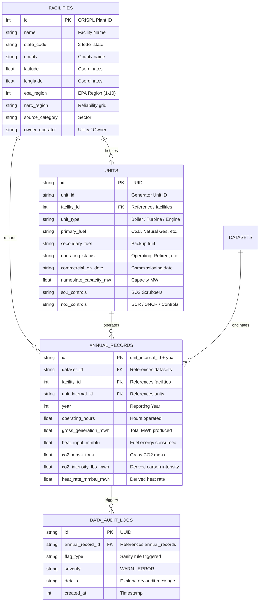

# EPA CAMPD Power Generation & Emissions Management System

A modern, high-performance web application and relational registry for tracking power generation facilities, continuous emissions monitoring (CEMS), and automated data quality audits based on the EPA Clean Air Markets Program Data (CAMPD) API.

Built for **CS396 Phase 1 Core**.

---

## Key Features

1. **Relational Generation & Emissions Registry**:
   - Normalized database schema supporting **1,582 facilities** and **5,030 generation units** across all 50 US states, DC, and Puerto Rico.
   - Comprehensive facility categorization by NERC Reliability Regions (ERCOT, SERC, WECC, RFC, MRO, NPCC, SPP, FRCC), Source Categories (Electric Utility, Cogeneration, Small Power Producer, etc.), and Owner/Operators.
   - Granular unit attributes including nameplate capacity (MW), operating status, commercial operation dates, primary/secondary fuels, and environmental control systems (NOx, SO2, PM, Hg).

2. **EPA CAMPD API Live Ingestion Pipeline**:
   - Direct integration with EPA Clean Air Markets Program API (`/emissions-mgmt/emissions/apportioned/annual`) using API keys.
   - Batching and high-throughput bulk upsert pipeline syncing operating hours, gross generation (MWh), heat input (MMBtu), and mass emissions (tons of CO2, SO2, NOx).
   - Dynamic server-side computation of derived metrics:
     - **Carbon Intensity**: $\text{lbs CO}_2 / \text{MWh} = \frac{\text{CO}_2\ (\text{tons}) \times 2000}{\text{Gross Generation}\ (\text{MWh})}$
     - **Heat Rate**: $\text{MMBtu} / \text{MWh} = \frac{\text{Heat Input}\ (\text{MMBtu})}{\text{Gross Generation}\ (\text{MWh})}$

3. **Automated Physical Sanity & Data Quality Auditing**:
   - Ingestion-time validation engine enforcing thermodynamic and operational bounds (`AUDIT_THRESHOLDS` in `client.ts`):
     - `ZERO_EMISSIONS_HIGH_HEAT` (`ERROR`): Fossil units with heat input > 1,000 MMBtu reporting 0.0 tons of CO2 emissions.
     - `PHANTOM_GENERATION` (`ERROR`): Generating power (> 0 MWh) with 0 operating hours recorded.
     - `EXTREME_HEAT_RATE` (`WARN`): Units operating outside thermodynamic boundaries (< 5.0 or > 25.0 MMBtu/MWh).
   - Dedicated audit log explorer with severity tracking (`WARN` | `ERROR`) and plain-language diagnostic descriptions.

4. **Geospatial Mapping & Interactive 3D Globe**:
   - Seamless dual-mode geospatial visualization of all 1,582 facilities across the US grid.
   - **2D Leaflet Map**: Interactive slippy map utilizing dark CARTO / OpenStreetMap basemaps with hardware-accelerated circle markers dynamically scaled by nameplate capacity (MW) or CO2 mass (tons) and color-coded by fuel type (Natural Gas, Coal, Oil, Renewables/Nuclear).
   - **3D D3 Orthographic Globe**: Canvas-rendered interactive globe powered by D3.js and TopoJSON (`us-states-10m` and `world-land-110m`), supporting drag rotation, momentum panning, zoom controls, auto-spin toggle, and responsive map pins.
   - Synchronized state/fuel filtering, metric switching (Generation Capacity vs. Gross CO2 Tonnage), and click-to-inspect facility modals.

5. **Head-to-Head Plant Benchmarking**:
   - Side-by-side comparative analysis of 2 to 4 power plants.
   - Direct evaluation of grid region, generation capacity, fleet fuel diversity, gross carbon tonnage, carbon intensity, and thermal efficiency.

6. **Clean, Modern UI (Tailwind CSS v4 & shadcn/ui)**:
   - Built with DRY, accessible component primitives (`Button`, `Badge`, `Card`, `Dialog`, `Table`, `Input`, `Select`, `StatTile`, `MetricBar`, `FuelBadge`, `CarbonIntensityBadge`).
   - Clean dark and light aesthetic with zero distracting emoticons, fully powered by SVG icons from `lucide-react`.

---

## Tech Stack

- **Framework**: [Next.js 15 (App Router)](https://nextjs.org) + [React 19](https://react.dev)
- **API & RPC**: [tRPC v11](https://trpc.io) with [TanStack Query v5](https://tanstack.com/query)
- **Database & ORM**: [Drizzle ORM](https://orm.drizzle.team) with [LibSQL / SQLite](https://github.com/tursodatabase/libsql-client-ts)
- **Geospatial & 2D Mapping**: [Leaflet](https://leafletjs.com) with CARTO / OpenStreetMap basemap tiles
- **3D Visualization & Math**: [D3.js](https://d3js.org) (orthographic projection, canvas rendering) + [TopoJSON](https://github.com/topojson/topojson-client)
- **Styling**: [Tailwind CSS v4](https://tailwindcss.com)
- **UI Primitives**: [shadcn/ui](https://ui.shadcn.com) style design system + [Lucide React](https://lucide.dev)
- **Validation**: [Zod](https://zod.dev)

---

## Database Architecture

> 📖 **Comprehensive Breakdown**: For an in-depth, plain-language walkthrough of what the data is, how every column is used, and how data is split across each front-end view with architecture diagrams, read [**DATABASE_BREAKDOWN.md**](./DATABASE_BREAKDOWN.md).



---

## Getting Started

### Prerequisites

- Node.js 20+
- npm or pnpm

### 1. Environment Setup

Copy `.env.example` to `.env`:

```bash
cp .env.example .env
```

Ensure your `.env` contains:

```env
DATABASE_URL="file:./db.sqlite"
CAMPD_API="your_epa_campd_api_key_here"
```

### 2. Install Dependencies

```bash
npm install
```

### 3. Database Migrations

Generate or apply Drizzle migrations:

```bash
npx drizzle-kit generate
```

### 4. Seed / Ingest Data

Apply migrations, seed facilities/units from CAMPD CSVs, then sync annual emissions:

```bash
npm run db:migrate
npx tsx scripts/seed-facilities-from-csv.ts --csv-dir "../CAMPD DATA"
npx tsx scripts/sync_campd.ts
```

Opening a facility detail dialog can also trigger an automatic CAMPD refresh when stored emissions data is stale.

### 5. Run the Development Server

```bash
npm run dev
```

Open [http://localhost:3000](http://localhost:3000) in your browser.

---

## Project Structure

```
├── drizzle/                     # Drizzle SQL migration files
├── public/                      # Static assets
│   └── geo/                     # TopoJSON for 3D globe (us-states-10m.json, world-land-110m.json)
├── scripts/                     # Data seeding & sync scripts
│   ├── seed-facilities-from-csv.ts  # Seed facilities/units from CAMPD CSVs
│   └── sync_campd.ts            # CLI CAMPD API annual emissions sync
├── src/
│   ├── app/                     # Next.js App Router
│   │   ├── _components/         # Application feature components
│   │   │   ├── audit-logs-table.tsx       # Sanity audit logs table
│   │   │   ├── d3-globe.tsx               # 3D D3 orthographic canvas globe
│   │   │   ├── database-explorer.tsx      # Explorer orchestrator (filters, tabs, compare)
│   │   │   ├── epa-primer.tsx             # EPA CAMPD domain primer & guide
│   │   │   ├── facilities-map.tsx         # Map & globe view container with metric controls
│   │   │   ├── facilities-table.tsx       # Paginated plant table
│   │   │   ├── facility-detail-dialog.tsx # Facility & unit inspector
│   │   │   ├── facility-filters.tsx       # Filter controls & search
│   │   │   ├── leaflet-map.tsx            # 2D Leaflet map with fuel-colored markers
│   │   │   ├── plant-comparison-dialog.tsx# Head-to-head benchmarking
│   │   │   └── stat-metrics.tsx           # High-level system KPI cards
│   │   ├── api/trpc/[trpc]/route.ts       # tRPC HTTP handler
│   │   ├── layout.tsx           # Root application layout
│   │   └── page.tsx             # Main page (server-side prefetch)
│   ├── components/ui/           # Reusable DRY shadcn/ui primitives
│   │   ├── badge.tsx
│   │   ├── button.tsx
│   │   ├── carbon-intensity-badge.tsx
│   │   ├── card.tsx
│   │   ├── dialog.tsx
│   │   ├── fuel-badge.tsx
│   │   ├── input.tsx
│   │   ├── metric-bar.tsx
│   │   ├── plant-role-badge.tsx
│   │   ├── select.tsx
│   │   ├── stat-tile.tsx
│   │   ├── table.tsx
│   │   └── theme-toggle.tsx
│   ├── env.js                   # Type-safe environment validation (t3-env)
│   ├── lib/                     # Client & server utilities
│   │   ├── map-utils.ts         # Fuel categorization, marker radii & colors
│   │   ├── plant-narrative.ts   # Plant summary narrative generators
│   │   └── utils.ts             # Tailwind class merging (cn)
│   ├── server/
│   │   ├── api/
│   │   │   ├── routers/facilities.ts  # tRPC facilities & stats procedures
│   │   │   ├── root.ts                # App router root
│   │   │   └── trpc.ts                # tRPC context & procedures
│   │   ├── campd/
│   │   │   └── client.ts              # EPA CAMPD API client & audit engine
│   │   └── db/
│   │       ├── index.ts               # LibSQL client instance
│   │       └── schema.ts              # Drizzle relational schema
│   ├── styles/                  # Tailwind CSS styling
│   │   └── globals.css
│   └── trpc/                    # tRPC client React & server helpers
├── DATABASE_BREAKDOWN.md        # Comprehensive database & column usage guide
└── README.md                    # Project overview & documentation
```

---

## Verification & Testing

Run linting and TypeScript checks:

```bash
npm run check
```

Run production build:

```bash
npm run build
```
