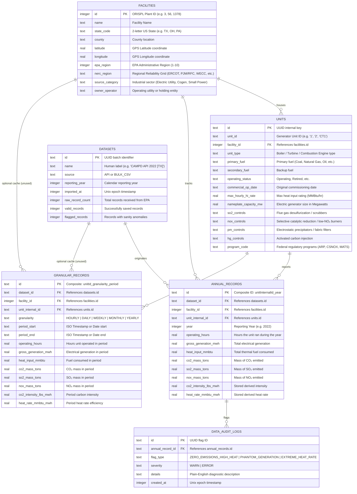

# GridPulse — EPA CAMPD Power & Emissions Intelligence

A Next.js web application and relational registry for US power plants, continuous emissions monitoring (CEMS) data, and automated thermodynamic sanity audits, backed by the EPA Clean Air Markets Program Data (CAMPD) API.

Built for **CS396 Phase 1 Core**. Column-level schema, view mapping, and ingestion details live in **[DATABASE_BREAKDOWN.md](./DATABASE_BREAKDOWN.md)**.

---

## Key Features

1. **Relational Generation & Emissions Registry**:
   - Normalized database schema supporting **1,582 facilities** and **5,030 generation units** across all 50 US states, DC, and Puerto Rico.
   - Comprehensive facility categorization by NERC Reliability Regions (ERCOT, SERC, WECC, RFC, MRO, NPCC, SPP, FRCC), Source Categories (Electric Utility, Cogeneration, Small Power Producer, etc.), and Owner/Operators.
   - Granular unit attributes including nameplate capacity (MW), operating status, commercial operation dates, primary/secondary fuels, and environmental control systems (NOₓ, SO₂, PM, Hg).

2. **EPA CAMPD API Live Ingestion Pipeline**:
   - Direct integration with EPA Clean Air Markets Program API (`/emissions-mgmt/emissions/apportioned/annual`) using API keys.
   - Batching and high-throughput bulk upsert pipeline syncing operating hours, gross generation (MWh), heat input (MMBtu), and mass emissions (tons of CO₂, SO₂, NOₓ).
   - Dynamic server-side computation of derived metrics:
     - **Carbon Intensity**: $\text{lbs CO}_2 / \text{MWh} = \frac{\text{CO}_2\ (\text{tons}) \times 2000}{\text{Gross Generation}\ (\text{MWh})}$
     - **Heat Rate**: $\text{MMBtu} / \text{MWh} = \frac{\text{Heat Input}\ (\text{MMBtu})}{\text{Gross Generation}\ (\text{MWh})}$

3. **Automated Physical Sanity & Data Quality Auditing**:
   - Ingestion-time validation engine enforcing thermodynamic and operational bounds (`AUDIT_THRESHOLDS` in `src/server/campd/client.ts`):
     - `ZERO_EMISSIONS_HIGH_HEAT` (`ERROR`): Fossil units with heat input > 1,000 MMBtu reporting 0.0 tons of CO₂ emissions.
     - `PHANTOM_GENERATION` (`ERROR`): Generating power (> 0 MWh) with 0 operating hours recorded.
     - `EXTREME_HEAT_RATE` (`WARN`): Units operating outside thermodynamic boundaries (< 5.0 or > 25.0 MMBtu/MWh).
   - Dedicated audit log explorer with severity tracking (`WARN` | `ERROR`) and plain-language diagnostic descriptions.

4. **Geospatial Mapping & Interactive 3D Globe**:
   - Seamless dual-mode geospatial visualization of all 1,582 facilities across the US grid.
   - **2D Leaflet Map**: Interactive slippy map utilizing dark CARTO / OpenStreetMap basemaps with hardware-accelerated circle markers dynamically scaled by nameplate capacity (MW) or CO₂ mass (tons) and color-coded by fuel type (Natural Gas, Coal, Oil, Renewables/Nuclear).
   - **3D D3 Orthographic Globe**: Canvas-rendered interactive globe powered by D3.js and TopoJSON (`us-states-10m` and `world-land-110m`), supporting drag rotation, momentum panning, zoom controls, auto-spin toggle, and responsive map pins.
   - Synchronized state/fuel filtering, metric switching (Generation Capacity vs. Gross CO₂ Tonnage), and click-to-inspect facility modals.

5. **Head-to-Head Plant Benchmarking**:
   - Side-by-side comparative analysis of 2 to 4 power plants.
   - Direct evaluation of grid region, generation capacity, fleet fuel diversity, gross carbon tonnage, carbon intensity, and thermal efficiency.

6. **Granular Temporal Emissions Telemetry**:
   - Hourly, daily, weekly, and monthly slices are fetched on demand from EPA CAMPD apportioned endpoints (no synthetic estimation).
   - **Yearly** granularity is aggregated from local `annual_records` (synced via `npm run sync:campd`).

7. **Clean, Modern UI (Tailwind CSS v4 & shadcn-style primitives)**:
   - Shared UI in `src/components/ui/` (`Button`, `Badge`, `Card`, `Dialog`, `Table`, `Input`, `Select`, `StatTile`, `KpiStrip`, `SegmentedControl`, `MetricBar`, `FuelBadge`, `CarbonIntensityBadge`, `EmptyState`, `InlineLoading`, `DataPanel`, `ThemeToggle`).
   - App shell and views in `src/app/_components/` (`DatabaseExplorer`, facility/map/compare dialogs, audit table, EPA reference primer).
   - Dark/light themes via `next-themes`; icons from `lucide-react`.

8. **Type-safe API (tRPC)**:
   - `facilities.getStats`, `getFilterOptions`, `getFacilities`, `getMapFacilities`, `getFacility`, `compareFacilities`, `getAuditLogs`, `getCampdPublishedThrough`, `getGranularEmissions`.

---

## Tech Stack

- **Framework**: [Next.js 16 (App Router)](https://nextjs.org) + [React 19](https://react.dev)
- **API & RPC**: [tRPC v11](https://trpc.io) with [TanStack Query v5](https://tanstack.com/query)
- **Database & ORM**: [Drizzle ORM](https://orm.drizzle.team) with [LibSQL / SQLite](https://github.com/tursodatabase/libsql-client-ts)
- **Geospatial & 2D Mapping**: [Leaflet](https://leafletjs.com) with CARTO / OpenStreetMap basemap tiles
- **3D Visualization & Math**: [D3.js](https://d3js.org) (orthographic projection, canvas rendering) + [TopoJSON](https://github.com/topojson/topojson-client)
- **Styling**: [Tailwind CSS v4](https://tailwindcss.com)
- **UI Primitives**: [shadcn/ui](https://ui.shadcn.com) style design system + [Lucide React](https://lucide.dev)
- **Validation**: [Zod](https://zod.dev)

Bundled TopoJSON assets come from the BSD-licensed
[world-atlas](https://github.com/topojson/world-atlas) and
[us-atlas](https://github.com/topojson/us-atlas) datasets.

---

## Database Architecture

Six normalized SQLite tables (via LibSQL), managed with Drizzle ORM. The `granular_records` table exists for future caching, but **granular UI data today comes from the EPA API** (plus `annual_records` for yearly rollups)—see **[DATABASE_BREAKDOWN.md](./DATABASE_BREAKDOWN.md)**.



---

## Getting Started

### Prerequisites

- Node.js 20.9+
- npm

### 1. Environment Setup

Copy `.env.example` to `.env`:

```bash
cp .env.example .env
```

Ensure your `.env` matches `src/env.js` (see `.env.example`):

```env
DATABASE_URL="file:./db.sqlite"
# Optional for remote Turso; omit for local file DB
DATABASE_AUTH_TOKEN=""
# Required for sync + live granular CAMPD calls
CAMPD_API="your_epa_campd_api_key_here"
# Optional; improves CARTO basemap tiles on the Leaflet map
NEXT_PUBLIC_CARTO_API=""
```

### 2. Install Dependencies

```bash
npm install
```

### 3. Database Migrations

Apply the committed Drizzle migrations:

```bash
npm run db:migrate
```

### 4. Seed / Ingest Data

Seed facilities/units from CAMPD CSVs, then sync annual emissions:

```bash
npm run db:seed -- --csv-dir "../CAMPD DATA"
npm run sync:campd
```

### 5. Run the Development Server

```bash
npm run dev
```

Open [http://localhost:3000](http://localhost:3000) in your browser.

---

## Verification & Testing

| Script             | Purpose                                                            |
| :----------------- | :----------------------------------------------------------------- |
| `npm run validate` | Format check, lint, typecheck, unit tests, production build        |
| `npm test`         | Node test runner over `src/lib/domain-utils.test.ts` (lib helpers) |
| `npm run check`    | ESLint + `tsc --noEmit`                                            |

```bash
npm run validate
```

## Repository Layout (high level)

| Path                         | Role                                                                              |
| :--------------------------- | :-------------------------------------------------------------------------------- |
| `src/app/`                   | Next.js App Router pages and `_components` UI                                     |
| `src/server/api/`            | tRPC router (`facilities`) and context                                            |
| `src/server/db/`             | Drizzle schema, queries, LibSQL client (`resolveDatabaseUrl` lives in `index.ts`) |
| `src/server/campd/client.ts` | EPA sync, granular fetch, ingestion audits                                        |
| `src/lib/`                   | Domain helpers (emissions math, CAMPD dates, plant narrative, map theming)        |
| `src/trpc/`                  | React + RSC tRPC clients (`query-client.ts` holds shared React Query setup)       |
| `scripts/`                   | `db:migrate`, `db:seed`, `sync:campd` CLI entrypoints                             |
