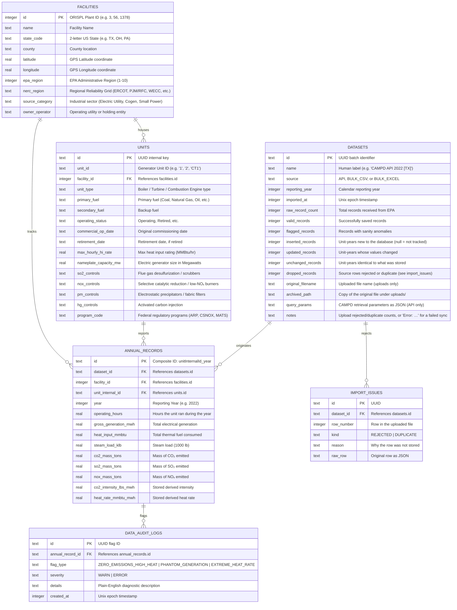

# epaData — EPA CAMPD Data Management System

A Next.js web application and relational registry for US power plants, continuous emissions monitoring (CEMS) data, and automated thermodynamic sanity audits, backed by the EPA Clean Air Markets Program Data (CAMPD) API.

Built for **CS396 Phase 1 Core**. Column-level schema, view mapping, and ingestion details live in **[DATABASE_BREAKDOWN.md](./DATABASE_BREAKDOWN.md)**.

---

## Key Features

1. **Relational Generation & Emissions Registry**:
   - Normalized database schema supporting **1,582 facilities** and **5,030 generation units** across all 50 US states, DC, and Puerto Rico.
   - Comprehensive facility categorization by NERC Reliability Regions (ERCOT, SERC, WECC, RFC, MRO, NPCC, SPP, FRCC), Source Categories (Electric Utility, Cogeneration, Small Power Producer, etc.), and Owner/Operators.
   - Granular unit attributes including nameplate capacity (MW), operating status, commercial operation dates, primary/secondary fuels, and environmental control systems (NOₓ, SO₂, PM, Hg).

2. **EPA CAMPD API Live Ingestion Pipeline**:
   - Direct integration with EPA Clean Air Markets Program API (`/emissions-mgmt/emissions/apportioned/annual`) using API keys.
   - Batching and high-throughput bulk upsert pipeline syncing operating hours, gross generation (MWh), heat input (MMBtu), and mass emissions (tons of CO₂, SO₂, NOₓ).
   - **Retrieve** in the header opens the retrieval dialog: pick a year range and optionally a state, facility IDs, fuel, unit type, and control technology (the fuel/unit-type/control lists come from CAMPD's master-data endpoints, so every choice is a value the API accepts). Each year is stored as its own `datasets` row with its parameters in `query_params`; the dialog shows the run status (running / done / error) and record counts, and lists past datasets with their parameters, counts, and an active / superseded / error label.
   - Dynamic server-side computation of derived metrics:
     - **Carbon Intensity**: $\text{lbs CO}_2 / \text{MWh} = \frac{\text{CO}_2\ (\text{tons}) \times 2000}{\text{Gross Generation}\ (\text{MWh})}$
     - **Heat Rate**: $\text{MMBtu} / \text{MWh} = \frac{\text{Heat Input}\ (\text{MMBtu})}{\text{Gross Generation}\ (\text{MWh})}$

3. **Automated Physical Sanity & Data Quality Auditing**:
   - Ingestion-time validation engine enforcing thermodynamic and operational bounds (`AUDIT_THRESHOLDS` in `src/lib/emissions-metrics.ts`, shared by the CAMPD sync and file uploads):
     - `ZERO_EMISSIONS_HIGH_HEAT` (`ERROR`): Fossil units with heat input > 1,000 MMBtu reporting 0.0 tons of CO₂ emissions.
     - `PHANTOM_GENERATION` (`ERROR`): Generating power (> 0 MWh) with 0 operating hours recorded.
     - `EXTREME_HEAT_RATE` (`WARN`): Units operating outside thermodynamic boundaries (< 5.0 or > 25.0 MMBtu/MWh).
   - Dedicated audit log explorer with severity tracking (`WARN` | `ERROR`) and plain-language diagnostic descriptions.

4. **Geospatial Mapping & Interactive 3D Globe**:
   - Seamless dual-mode geospatial visualization of all 1,582 facilities across the US grid.
   - **2D Leaflet Map**: Interactive slippy map utilizing dark CARTO / OpenStreetMap basemaps with hardware-accelerated circle markers dynamically scaled by nameplate capacity (MW) or CO₂ mass (tons) and color-coded by fuel type (Natural Gas, Coal, Oil, Renewables/Nuclear).
   - **3D D3 Orthographic Globe**: Canvas-rendered interactive globe powered by D3.js and TopoJSON (`us-states-10m` and `world-land-110m`), supporting drag rotation, momentum panning, zoom controls, auto-spin toggle, and responsive map pins.
   - Synchronized state/fuel filtering, metric switching (Generation Capacity vs. Gross CO₂ Tonnage), and click-to-inspect facility modals.

5. **Head-to-Head Plant Benchmarking**:
   - Side-by-side comparative analysis of 2 to 4 power plants.
   - Direct evaluation of grid region, generation capacity, fleet fuel diversity, gross carbon tonnage, carbon intensity, and thermal efficiency.

6. **Granular Temporal Emissions Telemetry**:
   - Hourly, daily, weekly, and monthly slices are fetched on demand from EPA CAMPD apportioned endpoints (no synthetic estimation).
   - **Yearly** granularity is aggregated from local `annual_records` (synced via `npm run sync:campd`).

7. **CSV & Excel Data Import** (**Upload Data** in the header):
   - Drag or select a `.csv`/`.xlsx` file (100 MB max). `scripts/parse_import.py` reads it, maps its columns to the project schema, rejects rows with missing or invalid values, and skips duplicate facility-unit-year records.
   - The dialog previews rows and lists every rejected, duplicate, and sanity-flagged record before anything is saved. Approving upserts `facilities`, `units`, and (for annual emissions files) `annual_records` + `data_audit_logs`, records a `datasets` row (filename, archive path, counts), saves every rejected/duplicate row to `import_issues`, and archives the original file in `uploads/`.

8. **Data Explorer Search (§8)** (**Units** tab, **More filters**):
   - Units view lists one row per facility-unit-year (`annual_records ⨝ units ⨝ facilities`); the Facilities view shares the same filters.
   - Basic filters: facility ID, name, unit ID, state, county, year, primary/secondary fuel, unit type, SO₂/NOₓ/PM control. Range filters: min/max operating hours, gross load, heat input, CO₂, SO₂, NOₓ. All filters AND together.
   - Ranking: sort by any column, then keep the first N overall or per state (`ROW_NUMBER() OVER (PARTITION BY state_code …)`). Units can be compared across facilities, and clicking a row opens the unit's history across all years.
   - Filters, sort, and page are kept in the URL, so a search can be shared or reloaded.

9. **CSV Download (§10)** (**Download** in the header, **CSV** beside the explorer results):
   - `GET /api/export?type=…` returns `text/csv` as an attachment, written by one shared CSV writer (`src/lib/csv.ts`, RFC 4180 quoting).
   - Types: `dataset&id=` (every unit-year a dataset holds with unit fuels, controls, program code, dates, and audit flags; `valid` + flagged rows of `invalid` = `dataset`), `valid&id=` (the dataset's records with no audit flags), `invalid&id=` (data-quality report: an upload's rejected/duplicate rows from `import_issues` with the original columns, plus every audit-flagged record of the dataset), `search&<explorer URL params>` (all matching facilities or unit-years in table order, ignoring paging), `selection&ids=&unitIds=` (every year of the compare selection), `provenance[&id=]` (datasets with source, parameters, file, dates, counts, status).
   - Search exports reuse the explorer's ranked queries (`rankedFacilities` / `rankedUnitYears`), so a download always matches the table. The upload report offers **Download rejected rows** after an import.

10. **Clean, Modern UI (Tailwind CSS v4 & shadcn-style primitives)**:

- Shared UI in `src/components/ui/` (`Button`, `Badge`, `Dialog`, `Table`, `Input`, `Select`, `StatTile`, `KpiStrip`, `SegmentedControl`, `MetricBar`, `FuelBadge`, `CarbonIntensityBadge`, `EmptyState`, `InlineLoading`, `DataPanel`, `ThemeToggle`).
- App shell and views in `src/app/_components/` (`DatabaseExplorer`, facility/map/compare/upload/retrieval/download dialogs, audit table, EPA reference primer).
- Dark/light themes via `next-themes`; icons from `lucide-react`.

11. **Type-safe API (tRPC)**:

- `facilities.getStats`, `getFilterOptions`, `getFacilities`, `getUnitYears`, `getMapFacilities`, `getFacility`, `getUnit`, `compareFacilities`, `getAuditLogs`, `getDatasets`, `getRetrievalOptions`, `getCampdPublishedThrough`, `getGranularEmissions`; mutation `retrieveCampd`.

---

## Tech Stack

- **Framework**: [Next.js 16 (App Router)](https://nextjs.org) + [React 19](https://react.dev)
- **API & RPC**: [tRPC v11](https://trpc.io) with [TanStack Query v5](https://tanstack.com/query)
- **Database & ORM**: [Drizzle ORM](https://orm.drizzle.team) with [LibSQL / SQLite](https://github.com/tursodatabase/libsql-client-ts)
- **Geospatial & 2D Mapping**: [Leaflet](https://leafletjs.com) with CARTO / OpenStreetMap basemap tiles
- **3D Visualization & Math**: [D3.js](https://d3js.org) (orthographic projection, canvas rendering) + [TopoJSON](https://github.com/topojson/topojson-client)
- **Styling**: [Tailwind CSS v4](https://tailwindcss.com)
- **UI Primitives**: [shadcn/ui](https://ui.shadcn.com) style design system + [Lucide React](https://lucide.dev)
- **Validation**: [Zod](https://zod.dev)

Bundled TopoJSON assets come from the BSD-licensed
[world-atlas](https://github.com/topojson/world-atlas) and
[us-atlas](https://github.com/topojson/us-atlas) datasets.

---

## Database Architecture

Six normalized SQLite tables (via LibSQL), managed with Drizzle ORM. Granular (hourly–monthly) UI data comes live from the EPA API, with `annual_records` backing yearly rollups—see **[DATABASE_BREAKDOWN.md](./DATABASE_BREAKDOWN.md)**.


```mermaid
erDiagram
    FACILITIES ||--o{ UNITS : "houses"
    FACILITIES ||--o{ ANNUAL_RECORDS : "tracks"
    UNITS ||--o{ ANNUAL_RECORDS : "reports"
    DATASETS ||--o{ ANNUAL_RECORDS : "originates"
    ANNUAL_RECORDS ||--o{ DATA_AUDIT_LOGS : "flags"
    DATASETS ||--o{ IMPORT_ISSUES : "rejects"

    FACILITIES {
        integer id PK "ORISPL Plant ID (e.g. 3, 56, 1378)"
        text name "Facility Name"
        text state_code "2-letter US State (e.g. TX, OH, PA)"
        text county "County location"
        real latitude "GPS Latitude coordinate"
        real longitude "GPS Longitude coordinate"
        integer epa_region "EPA Administrative Region (1-10)"
        text nerc_region "Regional Reliability Grid (ERCOT, PJM/RFC, WECC, etc.)"
        text source_category "Industrial sector (Electric Utility, Cogen, Small Power)"
        text owner_operator "Operating utility or holding entity"
    }

    UNITS {
        text id PK "UUID internal key"
        text unit_id "Generator Unit ID (e.g. '1', '2', 'CT1')"
        integer facility_id FK "References facilities.id"
        text unit_type "Boiler / Turbine / Combustion Engine type"
        text primary_fuel "Primary fuel (Coal, Natural Gas, Oil, etc.)"
        text secondary_fuel "Backup fuel"
        text operating_status "Operating, Retired, etc."
        text commercial_op_date "Original commissioning date"
        text retirement_date "Retirement date, if retired"
        real max_hourly_hi_rate "Max heat input rating (MMBtu/hr)"
        real nameplate_capacity_mw "Electric generator size in Megawatts"
        text so2_controls "Flue gas desulfurization / scrubbers"
        text nox_controls "Selective catalytic reduction / low-NOₓ burners"
        text pm_controls "Electrostatic precipitators / fabric filters"
        text hg_controls "Activated carbon injection"
        text program_code "Federal regulatory programs (ARP, CSNOX, MATS)"
    }

    DATASETS {
        text id PK "UUID batch identifier"
        text name "Human label (e.g. 'CAMPD API 2022 [TX]')"
        text source "API, BULK_CSV, or BULK_EXCEL"
        integer reporting_year "Calendar reporting year"
        integer imported_at "Unix epoch timestamp"
        integer raw_record_count "Total records received from EPA"
        integer valid_records "Successfully saved records"
        integer flagged_records "Records with sanity anomalies"
        integer inserted_records "Unit-years new to the database (null = not tracked)"
        integer updated_records "Unit-years whose values changed"
        integer unchanged_records "Unit-years identical to what was stored"
        integer dropped_records "Source rows rejected or duplicate (see import_issues)"
        text original_filename "Uploaded file name (uploads only)"
        text archived_path "Copy of the original file under uploads/"
        text query_params "CAMPD retrieval parameters as JSON (API only)"
        text notes "Upload rejected/duplicate counts, or 'Error: …' for a failed sync"
    }

    ANNUAL_RECORDS {
        text id PK "Composite ID: unitInternalId_year"
        text dataset_id FK "References datasets.id"
        integer facility_id FK "References facilities.id"
        text unit_internal_id FK "References units.id"
        integer year "Reporting Year (e.g. 2022)"
        real operating_hours "Hours the unit ran during the year"
        real gross_generation_mwh "Total electrical generation"
        real heat_input_mmbtu "Total thermal fuel consumed"
        real steam_load_klb "Steam load (1000 lb)"
        real co2_mass_tons "Mass of CO₂ emitted"
        real so2_mass_tons "Mass of SO₂ emitted"
        real nox_mass_tons "Mass of NOₓ emitted"
        real co2_intensity_lbs_mwh "Stored derived intensity"
        real heat_rate_mmbtu_mwh "Stored derived heat rate"
    }

    IMPORT_ISSUES {
        text id PK "UUID"
        text dataset_id FK "References datasets.id"
        integer row_number "Row in the uploaded file"
        text kind "REJECTED | DUPLICATE"
        text reason "Why the row was not stored"
        text raw_row "Original row as JSON"
    }

    DATA_AUDIT_LOGS {
        text id PK "UUID flag ID"
        text annual_record_id FK "References annual_records.id"
        text flag_type "ZERO_EMISSIONS_HIGH_HEAT | PHANTOM_GENERATION | EXTREME_HEAT_RATE"
        text severity "WARN | ERROR"
        text details "Plain-English diagnostic description"
        integer created_at "Unix epoch timestamp"
    }
```

---

## Getting Started

### Prerequisites

- Node.js 20.9+
- npm
- Python 3 (for file uploads). Create the repo venv so uploads get Excel support (the server uses `.venv/bin/python3` when it exists):

  ```bash
  python3 -m venv .venv && .venv/bin/pip install -r requirements.txt
  ```

### 1. Environment Setup

Copy `.env.example` to `.env`:

```bash
cp .env.example .env
```

Ensure your `.env` matches `src/env.js` (see `.env.example`):

```env
DATABASE_URL="file:./db.sqlite"
# Optional for remote Turso; omit for local file DB
DATABASE_AUTH_TOKEN=""
# Required for sync + live granular CAMPD calls
CAMPD_API="your_epa_campd_api_key_here"
# Optional; improves CARTO basemap tiles on the Leaflet map
NEXT_PUBLIC_CARTO_API=""
```

### 2. Install Dependencies

```bash
npm install
```

### 3. Database Migrations

`db.sqlite` is committed as the sample dataset (CAMPD facilities/units plus synced annual emissions), so the app runs without seeding. Apply any newer migrations to it:

```bash
npm run db:migrate
```

After editing `src/server/db/schema.ts`, create the next migration with `npm run db:generate`. The CLI scripts read `.env` themselves (`tsx --env-file=.env`).

### 4. Seed / Ingest Data

Optional, to rebuild or extend the data. Seed facilities/units from CAMPD CSVs, then sync annual emissions (defaults to last year):

```bash
npm run db:seed -- --csv-dir "../CAMPD DATA"
npm run sync:campd                          # last year
npm run sync:campd -- --year 2024           # one year
npm run sync:campd -- --from 2015 --to 2025 # a range
```

### 5. Run the Development Server

```bash
npm run dev
```

Open [http://localhost:3000](http://localhost:3000) in your browser.

---

## Verification & Testing

| Script             | Purpose                                                                            |
| :----------------- | :--------------------------------------------------------------------------------- |
| `npm run validate` | Format check, lint, typecheck, unit tests, production build                        |
| `npm test`         | Node test runner over `src/lib/*.test.ts` (lib helpers, upload parser, CSV writer) |
| `npm run check`    | ESLint + `tsc --noEmit`                                                            |

```bash
npm run validate
```

## Repository Layout (high level)

| Path                         | Role                                                                                   |
| :--------------------------- | :------------------------------------------------------------------------------------- |
| `src/app/`                   | Next.js App Router pages and `_components` UI                                          |
| `src/server/api/`            | tRPC router (`facilities`) and context                                                 |
| `src/server/db/`             | Drizzle schema, queries, LibSQL client (`resolveDatabaseUrl` lives in `index.ts`)      |
| `src/server/campd/client.ts` | EPA sync and granular fetch                                                            |
| `src/server/ingest.ts`       | Shared upserts + audit logging for the sync, seed script, and uploads                  |
| `src/server/data-import.ts`  | File upload preview/commit behind `POST /api/upload`                                   |
| `src/server/export.ts`       | CSV downloads behind `GET /api/export`                                                 |
| `src/lib/`                   | Domain helpers (emissions math, CAMPD dates, plant narrative, map theming)             |
| `src/trpc/`                  | React + RSC tRPC clients (`query-client.ts` holds shared React Query setup)            |
| `scripts/`                   | `db:migrate`, `db:seed`, `sync:campd` CLI entrypoints; `parse_import.py` upload parser |
