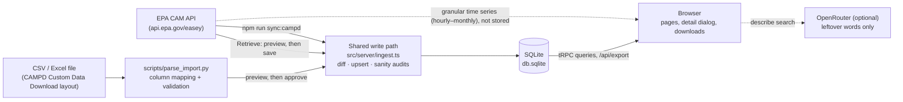
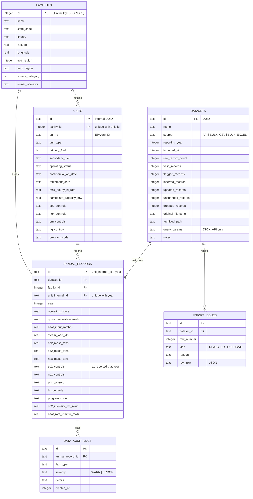

# epaData — EPA CAMPD Data Management System

epaData is a web application for retrieving, validating, storing, searching, and downloading
annual operating and emissions data for U.S. power-plant units. Data comes from the EPA Clean
Air Markets Program Data (CAMPD) API and from CSV/Excel files that users upload. Everything is
stored in a local SQLite database.

Built for **CS396 Phase 1 (Data Management Website)** by Raaj Banga and Arnav Bawankule.
Environmental evaluation (TRACI factors, indicators, scoring) is Phase 2 and not part of this
repository.

| Document                                                   | Contents                                                                     |
| :--------------------------------------------------------- | :--------------------------------------------------------------------------- |
| This README                                                | Setup, configuration, how to reproduce the results                           |
| [DATABASE_BREAKDOWN.md](./DATABASE_BREAKDOWN.md)           | Column-level schema, which view reads which table, ingestion flow            |
| [samples/README.md](./samples/README.md)                   | The sample upload file, row by row, with the expected validation report      |
| [report/epaData-slides.pptx](./report/epaData-slides.pptx) | Presentation slides (speaker notes in each slide)                            |
| [report/slides-outline.md](./report/slides-outline.md)     | Speaker notes and live-demo script: steps, inputs, expected results, timings |
| [report/main.pdf](./report/main.pdf)                       | Project report (LaTeX sources in `report/`, build with `npm run report`)     |

---

## Contents of the committed database

`db.sqlite` is committed, so the app works right after setup without an API key or seeding.

| Table             |   Rows | Notes                                                                                                   |
| :---------------- | -----: | :------------------------------------------------------------------------------------------------------ |
| `facilities`      |  1,619 | 50 states, DC, and Puerto Rico                                                                          |
| `units`           |  5,204 | 1,067.5 GW nameplate capacity                                                                           |
| `annual_records`  | 50,947 | One row per facility-unit-year, reporting years 2015–2026 (2026 is partial; EPA publishes it quarterly) |
| `datasets`        |     30 | All from the CAMPD API; 12 own records, 18 were superseded by later re-syncs                            |
| `data_audit_logs` |  6,909 | Physical-sanity flags on 6,432 records: 6,105 CO₂ not reported, 804 extreme heat rates (all WARN)       |
| `import_issues`   |      0 | Filled by uploads and retrievals that reject or skip rows                                               |

---

## Features

The specification's pages are real routes, ordered by workflow in the navigation bar: **Home**,
**Explore**, **Map**, then **Retrieve**, **Upload**, **Download**. Facility, unit, and
comparison details open in one dialog over any page; the open item is kept in the URL
(`?facility=3`, `?unit=…`), so it survives a reload and can be shared.

| Specification (`epaData_requirements` §) | Where it is in epaData                                                                                                                                                                                                                                                                                                                                                                                                                                         |
| :--------------------------------------- | :------------------------------------------------------------------------------------------------------------------------------------------------------------------------------------------------------------------------------------------------------------------------------------------------------------------------------------------------------------------------------------------------------------------------------------------------------------- |
| §9.1 Home page                           | `/`: introduction and summary figures, links to every function, unit-years per reporting year, data sources, glossary                                                                                                                                                                                                                                                                                                                                          |
| §5, §9.2 Retrieval                       | **Retrieve** page (`/retrieve`). Method: EPA CAM API, apportioned annual emissions. Filters: year range, state, facility IDs, fuel, unit type, control technology. Shows what the database already holds, previews what the API returns (New / Changed / Unchanged / Dropped, with database → API values for changed fields), then saves on approval. Past retrievals are listed with their parameters and counts. **Try** samples fill the form in one click. |
| §6, §9.3 Upload                          | **Upload** page (`/upload`). CSV or Excel (≤ 100 MB), read by `scripts/parse_import.py`. Shows the column mapping, missing values, rejected rows with reasons, duplicate facility-unit-years, sanity flags, and New/Changed/Unchanged counts. Approve or cancel. Rejected and duplicate rows are stored in `import_issues`; the original file is archived in `uploads/`. Past uploads are listed below the drop zone.                                          |
| §8.1 Basic search                        | **Explore** page (`/explore`), **Facilities** and **Unit-years** tabs. Always visible: one search box (description or name), state, year, fuel, unit type, facility ID, unit ID. **Advanced**: county, NERC region, secondary fuel, SO₂/NOₓ/PM control, operating status, audit flag/severity, origin                                                                                                                                                          |
| §8.2 Multi-criteria and range search     | All filters combine with AND. Min/max ranges for year, operating time, gross load, heat input, CO₂, SO₂, NOₓ, each inclusive (≥/≤) or strict (>/<) via the toggle beside it (under **Advanced**, which opens by itself when one of its filters is set)                                                                                                                                                                                                         |
| Rubric 6: Description search             | The Explore search box. A sentence such as "coal units in Kentucky with high CO2" becomes ordinary filters, shown as removable **Interpreted as** chips; text with nothing recognizable falls back to a name search. See [Description search](#description-search).                                                                                                                                                                                            |
| §8.3 Ranking and comparison              | **Ranking**: sort by any metric, keep the first N, overall or per state (`ROW_NUMBER() OVER (PARTITION BY state)`). **Compare**: tick 2–4 facilities or units, then **Compare** in the dock. **History**: the unit details list every reporting year.                                                                                                                                                                                                          |
| §8.4 Result requirements                 | Sortable, paginated tables; every row opens its details; **Download CSV** exports the current search; the tab, filters, sort, and page live in the URL                                                                                                                                                                                                                                                                                                         |
| §9.5 Facility / unit detail              | One detail dialog (`?facility=` / `?unit=`): identification, operating data and emissions per year, fuels and controls, source dataset and origin per year, audit flags. Facilities also have a granular time series (hourly to yearly, live API).                                                                                                                                                                                                             |
| §9.6, §10 Download                       | **Download** page (`/download`): complete dataset, valid records, invalid-record report, search results, selected facilities/units, provenance. CSV only.                                                                                                                                                                                                                                                                                                      |
| Data quality                             | **Audit flags** tab on Explore: every physical-sanity flag, paginated, sortable, and filtered by the same search form; each row links to its unit                                                                                                                                                                                                                                                                                                              |
| Extras                                   | **Map** page (`/map`): D3 globe and Leaflet map of all facilities with the Explore filters; DB-vs-API source labels throughout                                                                                                                                                                                                                                                                                                                                 |

### Physical-sanity rules

Applied to every annual record written by a retrieval, an upload, or the CLI sync
(`AUDIT_THRESHOLDS` in `src/lib/emissions-metrics.ts`). Flagged records are stored, not
dropped, and appear in the Audit flags tab and the invalid-record report.

| Flag                       | Severity | Condition                                          |
| :------------------------- | :------- | :------------------------------------------------- |
| `ZERO_EMISSIONS_HIGH_HEAT` | ERROR    | heat input > 1,000 MMBtu and CO₂ reported as 0     |
| `CO2_NOT_REPORTED`         | WARN     | heat input > 1,000 MMBtu and no CO₂ value reported |
| `PHANTOM_GENERATION`       | ERROR    | gross load > 0 MWh and operating time reported 0 h |
| `EXTREME_HEAT_RATE`        | WARN     | heat input ÷ gross load < 5 or > 25 MMBtu/MWh      |

Metrics the source leaves blank are stored as `NULL` ("not reported"), not 0, so the rules
can tell a missing value from a reported zero. Derived values stored with each record: CO₂
intensity = CO₂ (short tons) × 2,000 ÷ gross load (lb/MWh), and heat rate = heat input ÷
gross load (MMBtu/MWh); both are `NULL` when an input is missing or gross load is 0.

### Description search

`src/lib/describe-search.ts` turns a sentence into filters without a language model:

1. It matches the longest known phrase at each position against a vocabulary built from the
   database's own filter values (states, fuels, unit types, controls, counties) plus synonyms
   ("scrubber" → SO₂ control, "gas" → Natural Gas, state names → codes). Two-letter state codes
   count only in capitals, so "in" and "or" stay English.
2. It binds numbers to metrics ("CO2 over 500k tons", "under 50 tons SO2", "between 2015 and
   2020") and reads ranking words ("top 10", "lowest", "in each state").
3. "High" and "low" become thresholds: the 75th or 25th percentile of that metric among the
   unit-years that match the other filters, rounded to three significant figures.
4. Words it could not use are listed as "Not understood". If `OPENROUTER_API_KEY` is set,
   only those leftover words are sent to an OpenRouter model, which may add filters chosen
   from the same vocabulary. Its output is validated before use. Without a key, the parser's
   result is used as is.

The result is applied to the normal filter controls, so it can be refined by hand, exported,
and shared by URL like any other search.

---

## Where the data comes from

Explore, Map, the detail dialog, comparisons, audit flags, and downloads read **only the local
database**. Two features call the **EPA API live**: Retrieve (which then writes to the
database) and the granular time series.


```mermaid
flowchart LR
    EPA["EPA CAM API<br/>(api.epa.gov/easey)"]
    FILE["CSV / Excel file<br/>(CAMPD Custom Data Download layout)"]
    PY["scripts/parse_import.py<br/>column mapping + validation"]
    W["Shared write path<br/>src/server/ingest.ts<br/>diff · upsert · sanity audits"]
    DB[("SQLite<br/>db.sqlite")]
    UI["Browser<br/>pages, detail dialog, downloads"]
    LLM["OpenRouter (optional)<br/>leftover words only"]

    EPA -- "Retrieve: preview, then save" --> W
    EPA -- "npm run sync:campd" --> W
    FILE --> PY -- "preview, then approve" --> W
    W --> DB
    DB -- "tRPC queries, /api/export" --> UI
    EPA -. "granular time series (hourly–monthly), not stored" .-> UI
    UI -. "describe search" .-> LLM
```

| View                                                          | Source                                                     |
| :------------------------------------------------------------ | :--------------------------------------------------------- |
| Home coverage strip and tiles, Facilities, Units, Map, Audits | Local database                                             |
| Facility and unit detail, Compare                             | Local database                                             |
| Granular time series: Yearly                                  | Local database (`annual_records`)                          |
| Granular time series: Hourly, Daily, Weekly, Monthly          | EPA API, live; not stored                                  |
| Retrieve: "Already in the database" panel                     | Local database                                             |
| Retrieve: preview                                             | EPA API, live; nothing is written until **Approve & save** |
| Upload: validation report                                     | The uploaded file, compared with the local database        |
| Download (all six types)                                      | Local database                                             |

Each panel carries a label saying which source it shows ("Local database · last import …"
or "Live EPA CAMPD API"). Every unit-year also records the dataset that last wrote it, shown
as its **Origin** (CAMPD API or file upload) in the Unit-years table, the unit details, and the CSV
exports.

---

## Setup

Tested on macOS with Node.js 26 and Python 3.9. Linux works the same way. On Windows, use WSL,
or install `openpyxl` into the `python3` on your PATH (the server only looks for a virtual
environment at `.venv/bin/python3`).

### Prerequisites

- Node.js 20.9 or newer, with npm
- Python 3.9 or newer (reads uploaded files)
- Optional: an EPA API key ([api.data.gov signup](https://www.epa.gov/airmarkets/cam-api-portal))
  for Retrieve, `npm run sync:campd`, and the granular time series. Everything else works
  without it.

### Step by step

```bash
# 1. Get the code (or unzip the submission) and enter the folder
git clone <repository-url> epaData && cd epaData

# 2. JavaScript dependencies
npm install

# 3. Python environment for uploads (openpyxl reads .xlsx files)
python3 -m venv .venv
.venv/bin/pip install -r requirements.txt

# 4. Configuration
cp .env.example .env
#    then edit .env: DATABASE_URL can stay as is; add CAMPD_API to enable live EPA features

# 5. Bring the committed database up to the latest schema (no-op if already current)
npm run db:migrate

# 6. Start the app
npm run dev
```

Open <http://localhost:3000>. The home page should show 1,619 facilities and coverage for
2015–2026.

To check the installation: `npm run validate` runs the format check, ESLint, the TypeScript
compiler, the unit tests, and a production build. All five should pass.

### Environment variables

Defined and validated in `src/env.js`; `.env.example` lists them all. Only `DATABASE_URL` is
required. Keys are read on the server only and never sent to the browser.

| Variable                | Required | Purpose                                                                                                   |
| :---------------------- | :------- | :-------------------------------------------------------------------------------------------------------- |
| `DATABASE_URL`          | yes      | `file:./db.sqlite` (relative paths resolve from the project folder)                                       |
| `DATABASE_AUTH_TOKEN`   | no       | Only for a remote libSQL/Turso database; leave empty                                                      |
| `CAMPD_API`             | no       | EPA API key, sent as the `x-api-key` header. Enables Retrieve, `sync:campd`, and the granular time series |
| `OPENROUTER_API_KEY`    | no       | Enables the language-model fallback in description search                                                 |
| `OPENROUTER_MODEL`      | no       | OpenRouter model ID; default `nvidia/nemotron-3-super-120b-a12b:free`                                     |
| `NEXT_PUBLIC_CARTO_API` | no       | CARTO basemap key for the flat map: light or dark tiles to match the theme. Without it, public dark tiles |
| `READ_ONLY`             | no       | `true` on a hosted build (Vercel): Upload and Retrieve show a "run it locally" notice and refuse writes   |

---

## Reproducing the results

With the committed `db.sqlite` and `npm run dev` running, each link opens Explore in a
known state (the URL holds the whole search). The counts below were checked against
hand-written SQL.

| Check                                                               | Link                                                                                                                                                                                                | Expected                                                                                   |
| :------------------------------------------------------------------ | :-------------------------------------------------------------------------------------------------------------------------------------------------------------------------------------------------- | :----------------------------------------------------------------------------------------- |
| Multi-criteria (spec §8.2 example): KY, coal, 2025, CO₂ ≥ 500,000 t | [`/explore?tab=units&stateCode=KY&primaryFuel=Coal&year=2025&co2MassTonsMin=500000`](http://localhost:3000/explore?tab=units&stateCode=KY&primaryFuel=Coal&year=2025&co2MassTonsMin=500000)         | 25 unit-years                                                                              |
| Same search, facility level                                         | [`/explore?stateCode=KY&primaryFuel=Coal&year=2025&co2MassTonsMin=500000`](http://localhost:3000/explore?stateCode=KY&primaryFuel=Coal&year=2025&co2MassTonsMin=500000)                             | 8 facilities                                                                               |
| Group-and-rank: top CO₂ facility in each state, 2024                | [`/explore?year=2024&topN=1&rankGroup=state&sort=co2&dir=desc`](http://localhost:3000/explore?year=2024&topN=1&rankGroup=state&sort=co2&dir=desc)                                                   | 51 facilities, one per state with 2024 data                                                |
| Historical: one unit, 2015–2025                                     | [`/explore?tab=units&facilityId=3&unitId=1&yearMin=2015&yearMax=2025&sort=year&dir=asc`](http://localhost:3000/explore?tab=units&facilityId=3&unitId=1&yearMin=2015&yearMax=2025&sort=year&dir=asc) | 11 rows (Barry unit 1)                                                                     |
| Description search                                                  | Explore → type "coal units in Kentucky with high CO2" → **Search** (or click it under **Try**)                                                                                                      | KY · Coal · CO₂ ≥ 2,720,000 (top 25 %), sorted by CO₂, 97 unit-years                       |
| Retired units                                                       | [`/explore?tab=units&operatingStatus=Retired`](http://localhost:3000/explore?tab=units&operatingStatus=Retired)                                                                                     | 31 unit-years                                                                              |
| Sample upload                                                       | **Upload** → `samples/annual-emissions-sample.csv`                                                                                                                                                  | 25 rows: 21 valid (19 new, 1 changed, 1 unchanged), 3 rejected, 1 duplicate, 1 sanity flag |

The **Download CSV** button next to the results downloads exactly the rows the table shows (all pages).

Uploading the sample or approving a retrieval changes `db.sqlite`. Restore the committed copy
with `git restore db.sqlite`, then the numbers above apply again.

---

## Refreshing or rebuilding the data

The committed database was built with these commands; you only need them to extend or rebuild
it. They read `.env` themselves.

```bash
npm run sync:campd                           # last calendar year
npm run sync:campd -- --year 2024            # one year
npm run sync:campd -- --from 2015 --to 2025  # a range (one dataset per year)
npm run db:seed -- --csv-dir "../CAMPD DATA" # facilities + units from CAMPD facility CSVs
```

`sync:campd` writes directly. The **Retrieve** page does the same with a preview and an
approval step, and records the same dataset history.

After editing `src/server/db/schema.ts`, generate a migration with `npm run db:generate` and
apply it with `npm run db:migrate`.

---

## Database

Six tables in SQLite, defined with Drizzle ORM in `src/server/db/schema.ts`, migrations in
`drizzle/`. Facility, unit, and unit-year uniqueness is enforced by the primary key on
`facilities.id` and unique indexes on `units(facility_id, unit_id)` and
`annual_records(unit_internal_id, year)`. Foreign keys cascade on delete. Column-by-column
details: [DATABASE_BREAKDOWN.md](./DATABASE_BREAKDOWN.md).

Secondary indexes cover the common searches: facilities by state, name, county, NERC region,
and source category; units by facility, primary fuel, and operating status;
`annual_records(year, co2_mass_tons)` for year filters and CO₂ ranking;
`annual_records(facility_id, year)` for per-facility totals within a year; and the foreign
keys of `data_audit_logs` and `import_issues`. The `(facility_id, year)` index matters: with
only a `facility_id` index, SQLite answered "per-facility CO₂ in 2024" by scanning all of 2024
once per facility, and the top-facility-per-state query took 9.5 s instead of 22 ms.


```mermaid
erDiagram
    FACILITIES ||--o{ UNITS : "houses"
    FACILITIES ||--o{ ANNUAL_RECORDS : "tracks"
    UNITS ||--o{ ANNUAL_RECORDS : "reports"
    DATASETS ||--o{ ANNUAL_RECORDS : "last wrote"
    ANNUAL_RECORDS ||--o{ DATA_AUDIT_LOGS : "flags"
    DATASETS ||--o{ IMPORT_ISSUES : "rejects"

    FACILITIES {
        integer id PK "EPA facility ID (ORISPL)"
        text name
        text state_code
        text county
        real latitude
        real longitude
        integer epa_region
        text nerc_region
        text source_category
        text owner_operator
    }

    UNITS {
        text id PK "internal UUID"
        integer facility_id FK "unique with unit_id"
        text unit_id "EPA unit ID"
        text unit_type
        text primary_fuel
        text secondary_fuel
        text operating_status
        text commercial_op_date
        text retirement_date
        real max_hourly_hi_rate
        real nameplate_capacity_mw
        text so2_controls
        text nox_controls
        text pm_controls
        text hg_controls
        text program_code
    }

    DATASETS {
        text id PK "UUID"
        text name
        text source "API | BULK_CSV | BULK_EXCEL"
        integer reporting_year
        integer imported_at
        integer raw_record_count
        integer valid_records
        integer flagged_records
        integer inserted_records
        integer updated_records
        integer unchanged_records
        integer dropped_records
        text original_filename
        text archived_path
        text query_params "JSON, API only"
        text notes
    }

    ANNUAL_RECORDS {
        text id PK "unit_internal_id + year"
        text dataset_id FK
        integer facility_id FK
        text unit_internal_id FK "unique with year"
        integer year
        real operating_hours
        real gross_generation_mwh
        real heat_input_mmbtu
        real steam_load_klb
        real co2_mass_tons
        real so2_mass_tons
        real nox_mass_tons
        text so2_controls "as reported that year"
        text nox_controls
        text pm_controls
        text hg_controls
        text program_code
        real co2_intensity_lbs_mwh
        real heat_rate_mmbtu_mwh
    }

    IMPORT_ISSUES {
        text id PK
        text dataset_id FK
        integer row_number
        text kind "REJECTED | DUPLICATE"
        text reason
        text raw_row "JSON"
    }

    DATA_AUDIT_LOGS {
        text id PK
        text annual_record_id FK
        text flag_type
        text severity "WARN | ERROR"
        text details
        integer created_at
    }
```

Design assumptions to be aware of:

- **Controls and program codes are stored per unit-year** on `annual_records`, as the
  specification asks; `units` keeps the latest values for display. Fuel and unit type are
  still per unit, so the latest import wins for those.
- **Metrics are `NULL` when not reported.** Totals treat them as 0; range filters and
  percentile thresholds skip them; CSV exports leave them blank.
- **`annual_records.dataset_id` is the dataset that last wrote the record.** Re-importing a
  year moves its records to the new dataset; the older dataset stays in the history as
  "superseded". Values are overwritten, not versioned.
- **Origin is known per unit-year only.** Facility and unit rows have no dataset link.

---

## Technology

The specification suggests Flask, Jinja, and SQLAlchemy. epaData uses a TypeScript stack
for the web layer and keeps SQLite and Python:

| Specification          | epaData                                                                          | Role                                                                 |
| :--------------------- | :------------------------------------------------------------------------------- | :------------------------------------------------------------------- |
| Flask routes           | Next.js 16 route handlers (`/api/upload`, `/api/export`) and tRPC v11 procedures | Server endpoints; tRPC gives the browser typed calls for every query |
| Jinja templates        | React 19 components, rendered on the server first                                | Pages and dialogs                                                    |
| SQLAlchemy             | Drizzle ORM with drizzle-kit migrations                                          | Schema, typed queries, migrations                                    |
| SQLite                 | SQLite through the libSQL client                                                 | Unchanged                                                            |
| Python data processing | `scripts/parse_import.py` (csv, openpyxl)                                        | Reads and validates every upload (§6 step 3)                         |
| Bootstrap/CSS          | Tailwind CSS v4                                                                  | Styling, light and dark themes                                       |

Other libraries: TanStack Query (client caching), Zod (input validation on every endpoint),
Leaflet with CARTO/OpenStreetMap tiles (2D map), D3 and TopoJSON (globe), lucide-react
(icons), node:test with tsx (unit tests), ESLint and Prettier.

## Scripts

| Command                       | What it does                                                                                                   |
| :---------------------------- | :------------------------------------------------------------------------------------------------------------- |
| `npm run dev`                 | Development server on port 3000                                                                                |
| `npm run build` / `npm start` | Production build and server                                                                                    |
| `npm run validate`            | Format check, lint, typecheck, tests, build                                                                    |
| `npm test`                    | Unit tests in `src/lib/*.test.ts` (description parser, CSV writer, upload report, record diff, domain helpers) |
| `npm run check`               | ESLint and `tsc --noEmit`                                                                                      |
| `npm run db:migrate`          | Apply migrations in `drizzle/` to `DATABASE_URL`                                                               |
| `npm run db:generate`         | Create a migration after a schema change                                                                       |
| `npm run db:seed`             | Load facilities and units from CAMPD facility CSV files                                                        |
| `npm run sync:campd`          | Fetch annual emissions from the EPA API and store them                                                         |
| `npm run report`              | Build the project report with Tectonic (`report/main.tex` → `report/main.pdf`)                                 |

## Repository layout

| Path                                                                            | Contents                                                                                                                                                                       |
| :------------------------------------------------------------------------------ | :----------------------------------------------------------------------------------------------------------------------------------------------------------------------------- |
| `src/app/*/page.tsx`, `src/app/_components/`                                    | The six pages (`/`, `/explore`, `/map`, `/retrieve`, `/upload`, `/download`) and their views; `app-shell.tsx` holds the navigation, the detail dialog, and the comparison dock |
| `src/app/api/`                                                                  | Route handlers: tRPC endpoint, `upload` (preview and commit), `export` (CSV downloads)                                                                                         |
| `src/components/ui/`                                                            | Shared UI primitives (page layout, buttons, dialog, tables, badges, report sections)                                                                                           |
| `src/server/api/routers/facilities.ts`                                          | All tRPC queries and the retrieval mutation                                                                                                                                    |
| `src/server/db/`                                                                | Drizzle schema and database client                                                                                                                                             |
| `src/server/campd/client.ts`                                                    | EPA API client: retrieval, preview, granular time series                                                                                                                       |
| `src/server/ingest.ts`                                                          | Shared write path: diff against stored records, upserts, sanity audits                                                                                                         |
| `src/server/data-import.ts`, `src/server/export.ts`, `src/server/llm-search.ts` | Upload, CSV export, optional OpenRouter fallback                                                                                                                               |
| `src/lib/`                                                                      | Pure logic with tests: filters and URL state, description parser, emissions math, record diff, CSV writer                                                                      |
| `scripts/`                                                                      | CLI entry points (`migrate`, `seed-facilities-from-csv`, `sync_campd`) and `parse_import.py`                                                                                   |
| `drizzle/`                                                                      | SQL migrations                                                                                                                                                                 |
| `samples/`                                                                      | Sample upload files and their expected results                                                                                                                                 |
| `report/`                                                                       | Project report (LaTeX sources, figures, bibliography, PDF), presentation slides, speaker notes and demo script                                                                 |
| `uploads/`                                                                      | Archived original upload files (not committed)                                                                                                                                 |

## Data and credits

- Emissions, facility, and unit data: U.S. EPA Clean Air Markets Program Data (CAMPD), public
  domain.
- Map shapes: [us-atlas](https://github.com/topojson/us-atlas) and
  [world-atlas](https://github.com/topojson/world-atlas) (ISC license), bundled in
  `public/geo/`.
- Basemap tiles: © OpenStreetMap contributors, © CARTO.
